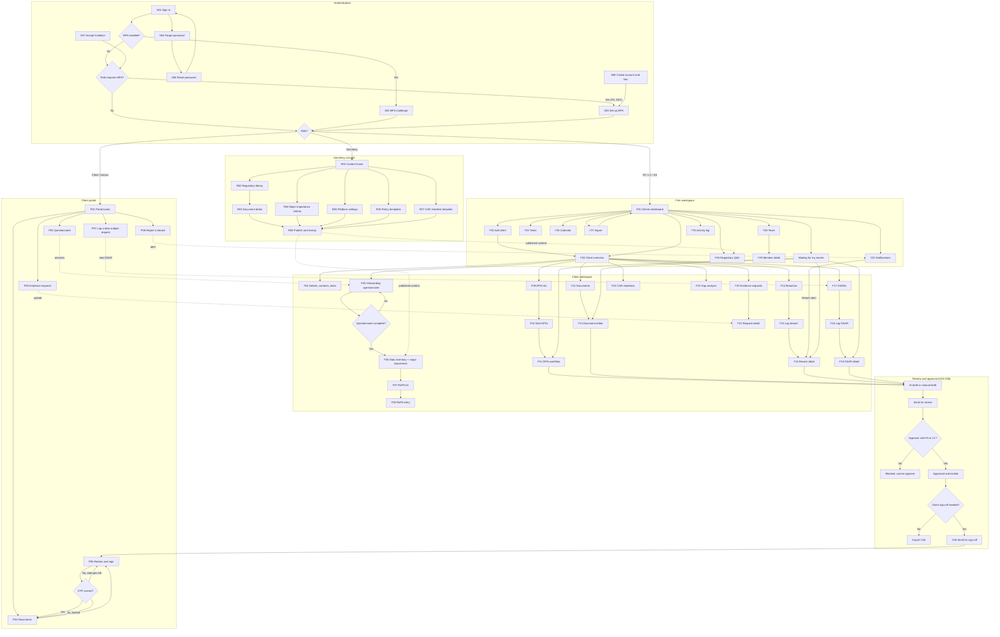

# DPO Copilot — App Flow (V1)

**Status:** Draft v1.1 (review queue added; FLAG-2 resolved)
**Based on:** PRD v1.3 and TRD v1.0 (scope unchanged)
**Author role:** Senior Product Designer

---

## 0. Conventions

- **Surfaces:** Firm workspace (`/app`), Client portal (`/portal`), Secretary console (`/secretary`), plus shared authentication pages.
- **Roles:** Firm Admin (FA), Lead Consultant (LC), Associate (AS), Client Contact (CC), Regulatory Content Secretary (SEC).
- **Screen IDs:** `S` = shared/auth, `F` = firm workspace, `P` = client portal, `R` = Secretary console, `C` = shared component (panel, dialog or drawer; not its own route).
- **[FLAG-n]** = a missing or contradictory flow. Nothing flagged has been designed around; each is listed in §5 for a decision.
- **Status names** used in this document:
  - Documents, DPIAs, notifications, DSAR responses: `Draft → In Review → Approved → Awaiting client sign-off → Client signed off`
  - Evidence requests: `Open → Submitted → Accepted` or `Rejected` (client can resubmit)
  - CAR checklist items: `Complete`, `In Progress`, `Missing`, `Not Applicable`
  - Breach and DSAR statuses beyond those above are **not defined in the PRD** [FLAG-9].

---

## 1. Journey Summary (Plain English)

### 1.1 Primary Journey — Take a new client to audit-ready
1. A **Firm Admin** signs in (with MFA), lands on the **Clients dashboard**, and adds a new client, assigning an Associate.
2. The **Associate** invites the client's contact to the portal and sends the **onboarding questionnaire**.
3. The **Client Contact** accepts the invite, sets a password, and completes the questionnaire on their phone over a few sessions.
4. The firm reviews the generated **data inventory**. The system shows a **major-importance indicator**; a **Lead Consultant** sets the final classification.
5. The Associate reviews the **proposed RoPA entries**, fills gaps and saves them.
6. The Associate starts **DPIAs** for high-risk activities and generates the three **policies** (Privacy Notice, Retention Policy, Consent Form). The **AI copilot** drafts sections; everything stays "AI draft" until approved.
7. The Lead Consultant opens **Waiting for my review** on the dashboard, **reviews and approves**; approved policies are **sent to the client for sign-off**. The Client Contact signs with a typed name and one-time code.
8. The Associate raises **evidence requests** tied to the **CAR readiness checklist**; the client uploads files; the firm accepts or rejects them.
9. The Lead Consultant runs **gap analysis**, resolves gaps, and watches the **readiness score** climb to 100%, then **exports** the file set.

### 1.2 Secondary Journeys
- **Existing client (import):** Firm Admin imports clients, contacts, RoPA, DPIA register and documents from Excel/CSV plus bulk files, fixes row errors, then continues from step 4.
- **Breach response:** A Client Contact reports a suspected breach from the portal → the firm team is alerted → the LC opens the incident, sees the **72-hour countdown**, generates notification drafts, approves them, and records when they were sent.
- **Data subject request:** A DSAR is logged (by the firm or by the client in the portal) → a **30-day deadline** is set → the firm drafts, approves and records the response, then closes it.
- **Regulatory question:** Any firm user asks the **Q&A copilot**; answers show citations or say the topic is not covered.
- **Team administration:** Firm Admin invites members, changes roles, assigns Associates to clients, deactivates users, and reviews the **activity log**.
- **Regulatory content update:** The **Secretary** uploads or edits regulatory sources, criteria, templates or the CAR checklist template, then **publishes**; all firms see the update without a release.
- **Account access:** Sign in, MFA, forgot/reset password, accept invitation, account settings.

---

## 2. Screen Inventory

| ID | Screen | Route | Roles | PRD refs |
|---|---|---|---|---|
| S01 | Sign in | `/sign-in` | All | F1, F10 |
| S02 | MFA challenge | `/sign-in/verify` | All with MFA on | NFR3 |
| S03 | Set up MFA (forced) | `/setup/mfa` | FA, SEC (mandatory); others optional via S08 | NFR3 |
| S04 | Forgot password | `/forgot-password` | All | — |
| S05 | Reset password | `/reset-password/[token]` | All | — |
| S06 | Create account & firm | `/sign-up` | New firm owner | FR1.1 [FLAG-1] |
| S07 | Accept invitation | `/invite/[token]` | Invited FA/LC/AS/CC | FR1.2, FR10.1 |
| S08 | Account settings | `/account` | All | NFR3 |
| S09 | System pages (403, 404, 500, expired link, deactivated) | various | All | FR1.4 |
| F01 | Clients dashboard (incl. Waiting for my review) | `/app` | FA, LC, AS (assigned only); review section FA, LC | FR2.2, FR2.4 |
| F02 | Add client | `/app/clients/new` | FA, LC | FR2.1 |
| F03 | Client overview | `/app/clients/[clientId]` | FA, LC, AS (assigned) | FR2.2 |
| F04 | Client details, contacts & team | `/app/clients/[clientId]/settings` | FA, LC; AS read-only [FLAG-12] | FR2.1, FR2.3, FR10.1 |
| F05 | Onboarding questionnaire (firm view) | `/app/clients/[clientId]/onboarding` | FA, LC, AS | FR3.1–3.3 |
| F06 | Data inventory & major importance | `/app/clients/[clientId]/data-inventory` | FA, LC, AS | FR3.4–3.5 |
| F07 | RoPA list | `/app/clients/[clientId]/ropa` | FA, LC, AS | FR4.1–4.3 |
| F08 | RoPA entry | `/app/clients/[clientId]/ropa/[entryId]` · `/ropa/new` | FA, LC, AS | FR4.2–4.3 |
| F09 | DPIA list | `/app/clients/[clientId]/dpias` | FA, LC, AS | F5 |
| F10 | Start DPIA | `/app/clients/[clientId]/dpias/new` | FA, LC, AS | FR5.1 |
| F11 | DPIA workflow | `/app/clients/[clientId]/dpias/[dpiaId]` | FA, LC, AS | FR5.2–5.4 |
| F12 | Documents list | `/app/clients/[clientId]/documents` | FA, LC, AS | F6 |
| F13 | Document editor | `/app/clients/[clientId]/documents/[docId]` | FA, LC, AS | FR6.2–6.4 |
| F14 | Breaches list | `/app/clients/[clientId]/breaches` | FA, LC, AS | F7 |
| F15 | Log breach | `/app/clients/[clientId]/breaches/new` | FA, LC, AS | FR7.1–7.2 |
| F16 | Breach detail | `/app/clients/[clientId]/breaches/[incidentId]` | FA, LC, AS | FR7.2–7.5 |
| F17 | DSAR list | `/app/clients/[clientId]/dsars` | FA, LC, AS | F16 |
| F18 | Log DSAR | `/app/clients/[clientId]/dsars/new` | FA, LC, AS | FR16.1–16.3 |
| F19 | DSAR detail | `/app/clients/[clientId]/dsars/[dsarId]` | FA, LC, AS | FR16.2–16.6 |
| F20 | Evidence requests | `/app/clients/[clientId]/evidence` | FA, LC, AS | FR8.1–8.3 |
| F21 | Evidence request detail | `/app/clients/[clientId]/evidence/[requestId]` | FA, LC, AS | FR8.2–8.3 |
| F22 | CAR readiness checklist | `/app/clients/[clientId]/car-readiness` | FA, LC, AS | FR8.4–8.6 |
| F23 | Gap analysis | `/app/clients/[clientId]/gaps` | FA, LC, AS | F12 |
| F24 | Tasks | `/app/tasks` (filterable by client) | FA, LC, AS | FR9.1 |
| F25 | Calendar | `/app/calendar` (filterable) | FA, LC, AS | FR9.2–9.3 |
| F26 | Regulatory Q&A | `/app/ask` | FA, LC, AS | F13 |
| F27 | Import | `/app/import` | FA | F17 |
| F28 | Team | `/app/settings/team` | FA | FR1.2–1.3 |
| F29 | Team member detail | `/app/settings/team/[userId]` | FA | FR1.2–1.3 |
| F30 | Activity log | `/app/settings/activity` | FA | FR14.5 |
| C01 | Notifications drawer | (header, all firm pages) | FA, LC, AS | FR7.6; F19 is Should-have |
| C02 | AI draft panel | (inside F11, F13, F16, F19, F23) | FA, LC, AS | F11, FR12.1 |
| C03 | Review & approval bar | (inside F11, F13, F16, F19) | FA, LC, AS | FR14.1–14.2 |
| C04 | Version history | (inside F11, F13) | FA, LC, AS | FR5.3, FR6.3, FR14.4 |
| C05 | Send for client sign-off dialog | (from C03) | FA, LC | FR14.1, FR14.3 |
| C06 | Export dialog | (from F07, F11, F13, F22) | FA, LC, AS | F15 |
| P01 | Portal home | `/portal` | CC | FR10.2 |
| P02 | Questionnaire | `/portal/questionnaire` | CC | FR3.2 |
| P03 | Evidence requests | `/portal/evidence` · `/portal/evidence/[requestId]` | CC | FR8.2 |
| P04 | Documents | `/portal/documents` | CC | FR10.2 |
| P05 | Review & sign document | `/portal/documents/[docId]/sign` | CC | FR14.3 |
| P06 | Report a breach | `/portal/report-breach` | CC | FR7.1 |
| P07 | Log a data subject request | `/portal/log-request` | CC | FR16.1 |
| R01 | Content home | `/secretary` | SEC | F18 |
| R02 | Regulatory library | `/secretary/library` | SEC | FR18.1 |
| R03 | Library document detail | `/secretary/library/[docId]` | SEC | FR18.1, FR18.4 |
| R04 | Major-importance criteria | `/secretary/criteria` | SEC | FR3.5, FR18.1 |
| R05 | Platform settings (DSAR period) | `/secretary/settings` | SEC | FR16.3 |
| R06 | Policy templates | `/secretary/templates` · `/secretary/templates/[templateId]` | SEC | FR6.1, FR18.1 |
| R07 | CAR checklist template | `/secretary/car-template` | SEC | FR8.4, §6.1 |
| R08 | Publish & change history | `/secretary/publish` | SEC | FR18.2–18.3 |

---

## 3. Mermaid Flowchart

---

## 4. Global States (apply to every screen unless a screen says otherwise)

| State | Behaviour |
|---|---|
| **Loading** | Skeleton placeholders matching the layout; buttons that submit show a spinner and are disabled to prevent double submit. |
| **Empty** | Short explanation + the screen's primary action (e.g. "No DPIAs yet — Start DPIA"). Users without permission for that action see the explanation only. |
| **Validation error** | Inline under each field, announced to screen readers; form keeps entered values. |
| **Save error / network error** | Toast "Couldn't save — check your connection and try again" with Retry; unsaved changes kept on screen. |
| **Success** | Toast confirming the action (e.g. "Entry saved"); destination per screen. |
| **Permission denied** | S09 403 page, including when a user edits a URL to reach another client or firm. No data is shown. |
| **Not found** | S09 404 page with "Back to dashboard". |
| **Session expired** | Redirect to S01 with "Your session ended — sign in again"; after sign-in, return to the page they were on. |
| **Background job (AI, export, import, ingestion)** | States: Queued → In progress → Done / Failed. Failed shows the reason and Retry. User can leave the page; completion appears in C01. |
| **AI unavailable** | AI buttons disabled with "AI features are temporarily unavailable." Manual editing still works. (Also covers TRD FLAG-1 if AI launches later.) |
| **File upload** | States: Uploading (progress bar) → Scanning → Ready, or Rejected (infected / wrong type / too large, with reason). |
| **Archived client** | All client screens read-only with an "Archived" banner; create/edit buttons hidden. |
| **Deadlines** | Shown in WAT. Due soon (amber, text label "Due soon") and Overdue (red, text label "Overdue") — never colour alone. |

---

## 5. Flags — Missing or Contradictory Flows

| Flag | Area | Issue | Decision needed |
|---|---|---|---|
| **FLAG-1** | S06 Create firm | FR1.1 lets "a user" create a firm, but there is no billing in V1 and pilots are recruited via ALDPCON. Is sign-up open to anyone, invite-only, or created by DPO Copilot staff? Is the firm's DPCO licence checked? | Sign-up model |
| ~~FLAG-2~~ | Review queue | **Resolved:** "Waiting for my review" section added to F01 (PRD FR2.4). | — |
| **FLAG-3** | Reviewer rejection | FR14.1 defines approval but not what happens when a reviewer does **not** approve. | Allow "Return to draft with comment"? |
| **FLAG-4** | Client declines to sign | FR10.2 / FR14.3 cover approval only. No path for a client to reject or request changes. | Add "Request changes" for Client Contacts? |
| **FLAG-5** | Client signature method | PRD Q-1 / TRD Q-1 unresolved. P05 shows the TRD's proposed typed name + one-time code; channel (email or SMS) unknown. | Signature method and OTP channel |
| **FLAG-6** | Portal visibility after reporting | After a client reports a breach or logs a DSAR, can they see its status? PRD lists only the actions. | What clients see after submitting |
| **FLAG-7** | Client contact lifecycle | No flow to deactivate/remove a Client Contact, and no rule for what contacts see when their client is archived. | Removal flow and archive behaviour |
| **FLAG-8** | Breach alert recipients | FR7.6 alerts "the assigned firm team". If no Associate is assigned, who is alerted? Should Lead Consultants always be alerted? | Alert recipients |
| **FLAG-9** | Breach & DSAR statuses | FR7.2 and FR16.2 mention "status" without defining values. | Status lists (proposal below each screen) |
| **FLAG-10** | Approval authority wording | FR11.3 says AI drafts need approval "by a Lead Consultant"; FR14.2 lets Firm Admins approve too. | Confirm Firm Admins can approve AI drafts |
| **FLAG-11** | Firm-side evidence upload | FR8.2 lets only Client Contacts upload evidence, but firms often hold evidence themselves (and F17 imports evidence files). | Can firm users upload evidence directly? |
| **FLAG-12** | Associate permissions | PRD doesn't say whether Associates can invite Client Contacts, create tasks, send evidence requests, or run gap checks. This flow allows the story-level actions and marks others read-only. | Confirm Associate permissions |
| **FLAG-13** | Questionnaire changes after inventory | If answers change after the inventory and RoPA exist, do proposals regenerate, and what happens to edited RoPA entries? | Re-generation rule |
| **FLAG-14** | Multiple contacts on one questionnaire | Two contacts editing the same questionnaire at once is not addressed. | Split by section, last-save-wins, or single owner? |
| **FLAG-15** | Secretary accounts | No flow for creating Secretary accounts (DPO Copilot staff) or any platform admin. | Provisioning method |
| **FLAG-16** | Last Firm Admin | No rule preventing the only Firm Admin from demoting or deactivating themselves. | Confirm "at least one Firm Admin" rule |
| **FLAG-17** | Q&A history | PRD doesn't say whether Q&A conversations are saved. | Save history or not |
| **FLAG-18** | Magic-link sign-in | TRD lists magic link as an option for Client Contacts; the PRD doesn't require it. Not included in this flow. | Include or drop |
| **FLAG-19** | Notifications scope | Only critical in-app alerts (breach) are Must-have; F19 (wider notifications) is Should-have. C01 is designed for the minimum; other events (sign-off completed, evidence submitted) depend on F19. | Confirm V1 notification events |
| **FLAG-20** | Contact across clients | Can one person be a Client Contact for more than one client (e.g. group companies) or more than one firm? This flow assumes **one client per portal account**. | Confirm |

---

## 6. Screen-by-Screen Behaviour

### 6.1 Authentication & Shared

#### S01 · Sign in — `/sign-in`
- **Purpose:** Let any user access their surface.
- **Reached from:** Direct URL, sign-out, session expiry, links in emails.
- **Shows:** Email, password, "Forgot password?", "Create a firm account" link (depends on FLAG-1).
- **Primary action:** Sign in → credentials checked →
  - MFA enabled → **S02**.
  - MFA required but not set (FA, SEC) → **S03**.
  - Otherwise → role destination: FA/LC/AS → **F01**; CC → **P01**; SEC → **R01**; or the page they were trying to reach.
- **Secondary actions:** Forgot password → **S04**; Create a firm → **S06**.
- **States & edge cases:** Wrong credentials → generic "Email or password is incorrect" (no hint which). Too many attempts → temporary lock message with wait time. Deactivated account → "Your access has been removed. Contact your firm administrator." Unverified invite (never accepted) → prompt to use invitation email.

#### S02 · MFA challenge — `/sign-in/verify`
- **Purpose:** Second factor.
- **Reached from:** S01.
- **Shows:** 6-digit code field from authenticator app; "Use a recovery code".
- **Primary action:** Verify → correct → role destination (as S01). Wrong → error, attempts remaining.
- **Secondary actions:** Use recovery code → accepts one-time recovery code → destination; Back to sign in → **S01**.
- **States & edge cases:** Too many wrong codes → lock + return to S01. Lost device with no recovery codes → "Contact your firm administrator" (no self-service reset; FA reset flow not defined in PRD — covered under FLAG-12/16 discussion).

#### S03 · Set up MFA — `/setup/mfa`
- **Purpose:** Enforce MFA for Firm Admin and Secretary (NFR3); optional setup for others (via S08).
- **Reached from:** S01/S07/S06 when role requires MFA and none is set; S08 for voluntary setup.
- **Shows:** QR code + manual key, code field, recovery codes after success.
- **Primary action:** Verify code → MFA enabled → recovery codes shown → "I've saved these" → role destination.
- **Secondary actions:** Download/copy recovery codes. Forced setup has **no skip**; voluntary setup has Cancel → **S08**.
- **States & edge cases:** Wrong code → retry. Leaving mid-setup (forced) → next sign-in returns here.

#### S04 · Forgot password — `/forgot-password`
- **Purpose:** Start password reset.
- **Shows:** Email field.
- **Primary action:** Send link → always shows "If an account exists, we've sent a link" → stays on page.
- **Secondary:** Back to sign in → **S01**.
- **States:** Rate limited → "Try again in a few minutes."

#### S05 · Reset password — `/reset-password/[token]`
- **Purpose:** Set a new password.
- **Reached from:** Reset email.
- **Shows:** New password + confirm, strength rules.
- **Primary action:** Save → all existing sessions ended → **S01** with success message.
- **States:** Expired/used link → S09 expired-link page with "Request a new link" → **S04**.

#### S06 · Create account & firm — `/sign-up` [FLAG-1]
- **Purpose:** First user creates the firm workspace and becomes Firm Admin (FR1.1).
- **Reached from:** S01 link (if sign-up is open).
- **Shows:** Name, email, password, firm name.
- **Primary action:** Create → account + firm created → **S03** (MFA mandatory for FA) → **F01** empty state.
- **Secondary:** Sign in instead → **S01**.
- **States:** Email already registered → "An account with this email exists — sign in." Access model unresolved (FLAG-1).

#### S07 · Accept invitation — `/invite/[token]`
- **Purpose:** Invited firm member or Client Contact joins.
- **Reached from:** Invitation email (from F28 or F04).
- **Shows:** Firm name (and client name for contacts), role, name field, password + confirm.
- **Primary action:** Join → account active → FA needs MFA → **S03**; otherwise role destination (**F01** or **P01**).
- **States & edge cases:** Expired/revoked invite → S09 "Ask whoever invited you to send a new invitation." Already accepted → **S01**. Signed in as a different user → "Sign out to accept this invitation."

#### S08 · Account settings — `/account`
- **Purpose:** Manage own profile and security.
- **Reached from:** User menu on every surface.
- **Shows:** Name, email (read-only), change password, MFA status, active sessions.
- **Primary actions:** Save profile → toast. Change password → current + new → toast; other sessions ended. Set up MFA → **S03**. Turn off MFA → blocked for FA and SEC ("MFA is required for your role").
- **Secondary:** Sign out → **S01**; Sign out other sessions → toast.

#### S09 · System pages
- **403 Access denied:** "You don't have access to this page." → Back to your home.
- **404 Not found:** → Back to your home.
- **500 Something went wrong:** Retry / Back to your home.
- **Expired or invalid link:** reason + next step (request new link / contact inviter).
- **Account deactivated:** shown at sign-in (see S01).

---

### 6.2 Firm Workspace

#### F01 · Clients dashboard — `/app`
- **Purpose:** See every accessible client's compliance status and where attention is needed (FR2.2).
- **Reached from:** Sign-in, logo/home in the sidebar, after adding or archiving a client.
- **Shows:** **Waiting for my review** section (FA, LC only; above the client list): every item in "In Review" across all clients — DPIAs, documents, breach notifications, DSAR responses — showing type, title, client, submitted by, time submitted, and deadline where one applies. Sorted by urgency: breach notifications first, then DSAR responses by deadline, then everything else oldest first. Count shown on the section header. Below it: table/cards per client: name, status, open gaps, overdue tasks, active breaches, open DSARs, CAR readiness %. Active breaches with countdown pinned at top. Sidebar: Clients, Tasks, Calendar, Ask (Q&A), Import (FA), Settings (FA). Header: notifications (C01), user menu.
- **Primary action:** Open client → **F03**.
- **Secondary actions:** Open a review item → its screen with the review bar (C03) ready: **F11** (DPIA), **F13** (document), **F16** (breach notification), **F19** (DSAR response); after approving, "Back to review queue" → **F01**. Add client (FA, LC) → **F02**. Filter/sort (status, assignee, readiness). Show archived → archived clients list (read-only). Open an active breach → **F16**.
- **States & edge cases:** Empty (new firm) → "Add your first client" + "Import existing clients" (FA) → **F27**. Associate with no assignments → "You haven't been assigned any clients yet. Ask your firm administrator." Counts must match underlying records (acceptance). Review section empty → "Nothing waiting for your review." Associates do not see the review section. An item approved by another reviewer disappears from everyone's queue on next load; opening it shows "Already approved by [name]".

#### F02 · Add client — `/app/clients/new`
- **Purpose:** Create a client record (FR2.1).
- **Reached from:** F01.
- **Shows:** Client name, sector, size, primary contact name/email (optional at this step), assigned team (multi-select of firm users).
- **Primary action:** Create client → record created with status "Onboarding", readiness 0%, CAR checklist instantiated from template → **F03**.
- **Secondary:** Cancel → **F01** (confirm if fields entered).
- **States:** Duplicate name → warning "A client with this name exists" (allow continue). Validation on required fields.

#### F03 · Client overview — `/app/clients/[clientId]`
- **Purpose:** Hub for one client.
- **Reached from:** F01, breadcrumbs, notifications.
- **Shows:** Header (name, status, major-importance classification or "Not yet classified", readiness %). Tiles: onboarding progress, open gaps, overdue tasks, active breaches (with countdown), open DSARs (next deadline), evidence outstanding, documents awaiting approval/sign-off. Client sub-navigation: Overview, Onboarding, Data inventory, RoPA, DPIAs, Documents, Breaches, DSARs, Evidence, CAR readiness, Gaps, Settings.
- **Primary action:** Next-step prompt based on progress (e.g. "Send onboarding questionnaire" → **F05**; "Review proposed RoPA entries" → **F07**).
- **Secondary actions:** Any sub-nav item; "Client tasks" → **F24** filtered; "Client calendar" → **F25** filtered.
- **States & edge cases:** Archived → read-only banner. Unassigned Associate reaching via URL → **403**.

#### F04 · Client details, contacts & team — `/app/clients/[clientId]/settings`
- **Purpose:** Edit client data, manage portal contacts and assigned team, archive (FR2.1, FR2.3, FR10.1).
- **Reached from:** F03 sub-nav.
- **Shows:** Client fields; Client Contacts list (name, email, invite status: Invited / Active); Assigned team list.
- **Primary actions:**
  - Invite contact → name + email → invitation email → contact listed as "Invited".
  - Save details → toast.
- **Secondary actions:** Resend / revoke invitation → status updated. Change assigned team (FA, LC) → Associates added/removed gain/lose access immediately. Archive client (FA, LC) → confirm dialog explaining read-only effect → client archived → **F01**. Remove active contact → **not defined** [FLAG-7].
- **States & edge cases:** Inviting an email already used by another account → "This email already has an account" [FLAG-20]. Associate view → read-only [FLAG-12].

#### F05 · Onboarding questionnaire (firm view) — `/app/clients/[clientId]/onboarding`
- **Purpose:** Send, track and, if needed, complete the questionnaire on the client's behalf (FR3.1–3.3).
- **Reached from:** F03.
- **Shows:** Status (Not sent / Sent / In progress x% / Completed), who it's assigned to, sections (organisation, data subjects, data categories incl. sensitive, purposes, systems/storage, recipients, cross-border transfers, retention, security measures, major-importance information) with answers.
- **Primary action:** Send to contact → choose Client Contact → email + portal task created → status "Sent".
- **Secondary actions:** Fill on behalf → sections become editable → save per section. Mark complete (after all required answers) → data inventory generated (background job) → **F06**. Send reminder → email.
- **States & edge cases:** No Client Contact yet → "Invite a contact first" → **F04**. Contact and firm editing simultaneously [FLAG-14]. Answers changed after completion [FLAG-13]. Required questions missing → "Mark complete" disabled with list of missing items.

#### F06 · Data inventory & major importance — `/app/clients/[clientId]/data-inventory`
- **Purpose:** Review the structured inventory and set major-importance classification (FR3.4–3.5).
- **Reached from:** F05 on completion, F03.
- **Shows:** Inventory tables (data subjects, data categories with sensitive flag, systems, purposes, recipients, transfers). Major-importance indicator: result (Likely / Unlikely), reasoning, NDPC guidance version cited. Final classification field.
- **Primary action (LC, FA):** Set final classification → confirm → saved + logged → client header updated.
- **Secondary actions:** Edit inventory item → saved + logged. "Review proposed RoPA entries" → **F07**.
- **States & edge cases:** Inventory still generating → job state. Associate sees indicator but classification control is disabled ("Only a Lead Consultant can finalise"). Criteria updated by Secretary after classification → banner "Criteria updated — re-check indicator" (re-evaluate on demand).

#### F07 · RoPA list — `/app/clients/[clientId]/ropa`
- **Purpose:** View and manage processing activities (FR4.1–4.3).
- **Reached from:** F03, F06.
- **Shows:** "Proposed" entries (from inventory) and "Active" entries; columns: purpose, lawful basis, data categories, retention, transfer flag; flagged empty required fields.
- **Primary action:** Review proposed entry → **F08** → Accept/save → becomes Active.
- **Secondary actions:** Add entry → **F08** new. Archive entry → confirm → moved to Archived filter. Export RoPA → **C06**.
- **States & edge cases:** Empty (no inventory) → "Complete onboarding to get proposed entries, or add one manually." Entries with missing required fields show warning badge.

#### F08 · RoPA entry — `/app/clients/[clientId]/ropa/[entryId]` · `/ropa/new`
- **Purpose:** Create/edit one processing activity (FR4.2–4.3).
- **Shows:** Purpose, lawful basis, data subject categories, data categories, recipients, cross-border transfers (+ safeguard), retention period, security measures, system/owner; linked DPIAs; change history.
- **Primary action:** Save → validated → logged → back to **F07**.
- **Secondary actions:** Start DPIA for this entry → **F10** pre-selected. Archive → confirm → **F07**. Cancel → **F07** (confirm if unsaved).
- **States:** Missing fields allowed to save as incomplete (flagged) — **confirm this is acceptable**; entry linked to an approved DPIA → edit warning "This entry is used by an approved DPIA."

#### F09 · DPIA list — `/app/clients/[clientId]/dpias`
- **Purpose:** See all DPIAs and their status (F5).
- **Shows:** Title, linked RoPA entries, status, version, risk level, review date.
- **Primary action:** Start DPIA → **F10**.
- **Secondary:** Open DPIA → **F11**.
- **States:** Empty → "No DPIAs yet." If gap check found high-risk processing without DPIA, show hint linking to **F23**.

#### F10 · Start DPIA — `/app/clients/[clientId]/dpias/new`
- **Purpose:** Create a DPIA linked to RoPA entries (FR5.1).
- **Shows:** Title, RoPA entry multi-select (required).
- **Primary action:** Create → DPIA in Draft → **F11** step 1.
- **Secondary:** Cancel → **F09**.
- **States:** No RoPA entries → "Add RoPA entries first" → **F07**. Create disabled until at least one entry selected (acceptance).

#### F11 · DPIA workflow — `/app/clients/[clientId]/dpias/[dpiaId]`
- **Purpose:** Complete, review and approve a DPIA (FR5.2–5.4).
- **Shows:** Stepper: 1 Description, 2 Necessity & proportionality, 3 Risk identification, 4 Risk scoring (likelihood × impact grid), 5 Mitigations, 6 Residual risk, 7 Conclusion. Status, version, review date. C02 AI panel per step; C03 review bar; C04 version history.
- **Primary action:** Save & continue → next step; on step 7 → "Send for review" (C03).
- **Secondary actions:** Draft with AI (C02) → background job → draft inserted as "AI draft" → Accept / Edit / Discard. Set review date → added to calendar. Export (Approved only) → **C06**.
- **After approval:** Locked; "Edit" creates new Draft version (C04), previous stays viewable. Optional client sign-off → **C05**.
- **States & edge cases:** Associate cannot approve (button hidden; API blocks). Linked RoPA entry archived → warning. Leaving with unsaved step → confirm.

#### F12 · Documents list — `/app/clients/[clientId]/documents`
- **Purpose:** Manage the three V1 policies/notices (F6).
- **Shows:** Document, template, status, version, client sign-off status, NDPA mapping tags.
- **Primary action:** Generate document → choose template (Privacy Notice, Data Retention Policy, Consent Form) → pre-filled draft created (background job) → **F13**.
- **Secondary:** Open → **F13**.
- **States:** Empty → "Generate your first policy." Inventory/RoPA incomplete → warning "Some fields couldn't be pre-filled" (still allowed).

#### F13 · Document editor — `/app/clients/[clientId]/documents/[docId]`
- **Purpose:** Edit, map, review, approve and send documents for sign-off (FR6.2–6.4, F14).
- **Shows:** Rich-text editor; highlighted pre-filled fields; NDPA provision mapping; optional reference tags (ISO, SOC 2, GDPR, etc.); C02, C03, C04.
- **Primary action:** Save → new draft revision. Send for review → status In Review.
- **Secondary actions:** Improve/draft section with AI (C02). Add NDPA mapping / reference tag. Export (Approved) → **C06**. Send for client sign-off (Approved, FA/LC) → **C05**.
- **States & edge cases:** Approved/signed versions read-only; Edit creates new version needing new approval and signature. Reviewer rejection path undefined [FLAG-3]. Client rejection path undefined [FLAG-4].

#### F14 · Breaches list — `/app/clients/[clientId]/breaches`
- **Purpose:** Track incidents (F7).
- **Shows:** Incident, reported by (firm/client), awareness time, countdown/time remaining, severity, notification required, notification status.
- **Primary action:** Log breach → **F15**.
- **Secondary:** Open → **F16**.
- **States:** Empty → "No incidents recorded." Overdue deadlines flagged "Overdue".

#### F15 · Log breach — `/app/clients/[clientId]/breaches/new`
- **Purpose:** Record an incident (FR7.1–7.2).
- **Shows:** Awareness time (date + time, WAT, required), description, data and subjects affected, estimated number affected, containment actions, severity, notification required (Yes/No/Not yet known).
- **Primary action:** Save → incident created → countdown starts from awareness time → calendar deadline created → **F16**.
- **Secondary:** Cancel → **F14**.
- **States & edge cases:** Awareness time in the future → blocked. Awareness time more than 72 h ago → saved with "Deadline already passed" banner.

#### F16 · Breach detail — `/app/clients/[clientId]/breaches/[incidentId]`
- **Purpose:** Manage response within 72 hours (FR7.2–7.5).
- **Shows:** Countdown (normal → "Due soon" under 24 h → "Overdue"), incident fields, remediation actions, notification drafts (regulator, data subjects) with status, notification record (sent date/time, channel, recipients), activity.
- **Primary action:** Generate notification drafts (C02) → two AI drafts → review → approve (C03).
- **Secondary actions:** Edit incident fields → logged. Record notification sent → date/time, method, recipient → saved (only after approval). Add remediation action. Mark "notification not required" with reason.
- **States & edge cases:** Opened from client report → banner "Reported by [contact] via portal at [time]". Status values undefined [FLAG-9]. The system never submits to NDPC — button copy says "Record as sent".

#### F17 · DSAR list — `/app/clients/[clientId]/dsars`
- **Purpose:** Track data subject requests (F16).
- **Shows:** Type, requester, date received, deadline (30 days), days remaining, status, source (firm/portal).
- **Primary action:** Log DSAR → **F18**.
- **Secondary:** Open → **F19**; filter by status/type.
- **States:** Empty → "No requests logged." Due soon / Overdue labels.

#### F18 · Log DSAR — `/app/clients/[clientId]/dsars/new`
- **Purpose:** Record a DSAR (FR16.1–16.3).
- **Shows:** Request type (access, rectification, erasure, objection, portability), date received, requester details, identity verification status, related processing activities (RoPA).
- **Primary action:** Save → deadline set to date received + 30 days (current published setting) → calendar item → **F19**.
- **Secondary:** Cancel → **F17**.
- **States:** Date received in future → blocked. Received more than 30 days ago → "Deadline already passed" banner.

#### F19 · DSAR detail — `/app/clients/[clientId]/dsars/[dsarId]`
- **Purpose:** Verify, respond and close (FR16.2–16.6).
- **Shows:** Request details, deadline countdown, identity verification status, linked RoPA entries, response draft (C02/C03), history.
- **Primary action:** Draft response with AI → AI draft → edit → Send for review → Approve.
- **Secondary actions:** Update identity verification status. Record response as sent (approved only). Close request → kept as record, added to client evidence.
- **States & edge cases:** "Record as sent" disabled until approved (acceptance). Who performs identity verification is not defined [FLAG-9 area]. Status values undefined [FLAG-9].

#### F20 · Evidence requests — `/app/clients/[clientId]/evidence`
- **Purpose:** Request and track evidence (FR8.1–8.3).
- **Shows:** Request title, linked checklist item, due date, status (Open/Submitted/Accepted/Rejected), files count.
- **Primary action:** New request → dialog: title, description, due date, linked CAR checklist item → created → client notified via portal (and email) → listed as Open.
- **Secondary:** Open request → **F21**. Filter by status/category.
- **States:** Empty → "No evidence requested yet." Overdue labels. Firm-side upload not defined [FLAG-11].

#### F21 · Evidence request detail — `/app/clients/[clientId]/evidence/[requestId]`
- **Purpose:** Review submitted evidence.
- **Shows:** Request details, uploaded files (scan status, uploader, time), comment thread of accept/reject decisions.
- **Primary action:** Accept → status Accepted → linked checklist item can be marked Complete (prompt) → score updates.
- **Secondary actions:** Reject → **comment required** → status Rejected → client sees comment and can resubmit. Download file (signed link). Edit due date.
- **States:** File still scanning → download disabled. Infected file → shown as "Rejected by security scan".

#### F22 · CAR readiness checklist — `/app/clients/[clientId]/car-readiness`
- **Purpose:** Track readiness against the 5-category template (FR8.4–8.6).
- **Shows:** Overall score and per-category score; categories (Governance; Technology; Accountability & Risk; Cross-Border Transfer; Data Processors) with items, status, linked evidence/records, auto-linked suggestions awaiting confirmation.
- **Primary action:** Set item status → score recalculates immediately.
- **Secondary actions:** Mark Not Applicable → **reason required** → excluded from score. Confirm/reject auto-link suggestion. Request evidence for item → **F20** dialog pre-filled. Export checklist → **C06**.
- **States & edge cases:** Template updated by Secretary → new items appear as Missing with "New item" badge. Items cannot be deleted.

#### F23 · Gap analysis — `/app/clients/[clientId]/gaps`
- **Purpose:** Find and resolve compliance gaps (F12).
- **Shows:** Last run time; gaps with severity, rule, linked record, AI explanation and suggested next action.
- **Primary action:** Run gap check → background job → results list.
- **Secondary actions:** Open linked record → relevant screen. Mark resolved → removed from open list. Mark Not Applicable → reason required → logged.
- **States:** Never run → "Run your first gap check." No gaps → success state "No gaps found." AI unavailable → gaps still shown (rule-based) without explanations.

#### F24 · Tasks — `/app/tasks`
- **Purpose:** Create and track work (FR9.1).
- **Shows:** Task list: title, client, assignee, due date, status; filters (client, assignee, status, overdue).
- **Primary action:** New task → title, client, assignee, due date → created → appears on calendar.
- **Secondary:** Change status, reassign, edit, filter.
- **States:** Empty → "No tasks." Associates see only tasks for assigned clients. Who can create tasks [FLAG-12].

#### F25 · Calendar — `/app/calendar`
- **Purpose:** See all deadlines (FR9.2–9.3).
- **Shows:** Month/week/list views with breach deadlines, DSAR deadlines, DPIA review dates, evidence due dates, CAR filing date, tasks; filters by client and assignee.
- **Primary action:** Open item → its source screen (F16, F19, F11, F21, F22, F24).
- **Secondary:** Switch view, filter.
- **States:** Empty period → "Nothing due." CAR filing date source not defined in PRD (is it a platform-wide date set by the Secretary or per client?) — **confirm**.

#### F26 · Regulatory Q&A — `/app/ask`
- **Purpose:** Ask about the NDPA and NDPC guidance (F13).
- **Shows:** Question box; answers with citations (document, section, version) and "Guidance, not legal advice" notice.
- **Primary action:** Ask → answer with citations **or** "The library doesn't cover this question."
- **Secondary:** Open citation → source passage view.
- **States & edge cases:** AI unavailable state. History not defined [FLAG-17]. Client Contacts never reach this route (403).

#### F27 · Import — `/app/import`
- **Purpose:** Bring in existing records (F17).
- **Shows:** Stepper: 1 Choose type (Clients & contacts / RoPA entries / DPIA register / Documents & evidence files) → 2 Choose target client (for client-level types) → 3 Download template → 4 Upload Excel/CSV (plus files for documents/evidence) → 5 Validation preview → 6 Confirm → 7 Results.
- **Primary action:** Confirm import (step 6) → records created, marked "Imported" in activity log → results summary with links.
- **Secondary actions:** Fix and re-upload; Skip invalid rows; Download error report; Cancel → nothing saved.
- **States & edge cases:** Wrong file type or template columns → blocked with reason. Files listed in index but not uploaded (or uploaded but unmatched) → listed before saving. Files infected → rejected. Duplicate clients → warning. Nothing is saved before confirm (acceptance).

#### F28 · Team — `/app/settings/team`
- **Purpose:** Manage firm users (FR1.2).
- **Shows:** Members: name, email, role, status (Invited/Active/Deactivated), assigned clients count.
- **Primary action:** Invite member → email + role → invitation sent → listed as Invited.
- **Secondary:** Open member → **F29**; resend/revoke invite.
- **States:** Only FA can reach (others 403).

#### F29 · Team member detail — `/app/settings/team/[userId]`
- **Purpose:** Change role, client assignments, deactivate (FR1.2–1.3).
- **Shows:** Profile, role, assigned clients (for Associates), MFA status, recent activity.
- **Primary actions:** Change role → confirm → access updated immediately. Edit client assignments → saved → access changes immediately.
- **Secondary:** Deactivate → confirm → sessions revoked → status Deactivated; Reactivate.
- **States & edge cases:** Last Firm Admin demoting/deactivating themselves [FLAG-16]. Deactivated user's open tasks remain (reassign prompt).

#### F30 · Activity log — `/app/settings/activity`
- **Purpose:** Audit trail (FR14.5).
- **Shows:** Time (WAT), user, action (create/edit/approve/sign/export/delete, login, AI generation, import), client, record link.
- **Primary action:** Filter by user, client, action, date range.
- **Secondary:** Open linked record.
- **States:** Read-only; no edit or delete anywhere.

---

### 6.3 Shared Components

#### C01 · Notifications drawer
- **Purpose:** Surface critical alerts in-app (FR7.6).
- **Reached from:** Bell icon in firm header (badge count).
- **Shows:** Client-reported breaches (always, top), completed background jobs (AI drafts, imports, exports).
- **Action:** Click item → source screen (e.g. **F16**). Mark all read.
- **Edge:** Wider events depend on F19 [FLAG-19]; recipients for breach alerts [FLAG-8].

#### C02 · AI draft panel
- **Purpose:** Generate and handle AI drafts (F11, FR12.1).
- **Actions:** Generate → job states → draft labelled "AI draft" → Accept (inserts, still unapproved) / Edit / Discard / Regenerate.
- **Edge:** Not shown to Client Contacts. AI unavailable state. Failed job → reason + Retry.

#### C03 · Review & approval bar
- **Purpose:** Move items through Draft → In Review → Approved (FR14.1–14.2).
- **Actions:** Send for review (any firm role) → In Review. Approve (FA/LC only) → locked version → offers Export and Send for client sign-off.
- **Edge:** Associate sees "Awaiting approval by a Lead Consultant." Reject/return path undefined [FLAG-3]. FA approving AI drafts [FLAG-10].

#### C04 · Version history
- **Purpose:** View past versions (FR5.3, FR14.4).
- **Actions:** Open version (read-only); see approval and signature details per version.

#### C05 · Send for client sign-off dialog
- **Purpose:** Request client signature on an approved version (FR14.1, FR14.3).
- **Shows:** Document/version, choose Client Contact(s).
- **Action:** Send → status "Awaiting client sign-off" → appears in **P04** + email notice.
- **Edge:** No active contacts → "Invite a contact first" → **F04**. New version created while awaiting → previous request cancelled.

#### C06 · Export dialog
- **Purpose:** Export approved items (F15).
- **Shows:** Format (PDF / Word); what's included (client name, version, approval date, signature details).
- **Action:** Export → background job → download link.
- **Edge:** Unapproved items → export disabled with reason.

---

### 6.4 Client Portal

#### P01 · Portal home — `/portal`
- **Purpose:** One place for everything the client must do (FR10.2).
- **Reached from:** Sign-in, invitation, email links.
- **Shows:** Client name and DPCO firm name; compliance status summary (readiness %); "To do" list: questionnaire, open/rejected evidence requests, documents awaiting sign-off; quick actions: **Report a breach**, **Log a data subject request**.
- **Primary action:** Open the top to-do item → P02 / P03 / P05.
- **Secondary:** Report a breach → **P06**; Log a request → **P07**; Documents → **P04**; Account → **S08**.
- **States & edge cases:** Nothing to do → "You're all caught up." Client archived [FLAG-7]. Mobile-first layout, 360 px minimum.

#### P02 · Questionnaire — `/portal/questionnaire`
- **Purpose:** Complete onboarding questions (FR3.2).
- **Shows:** Sections with progress, save-and-resume, help text per question.
- **Primary action:** Save section → progress updated. Submit (when all required answered) → "Thank you" → **P01**.
- **Secondary:** Save and exit → **P01**.
- **States & edge cases:** Autosave on section change; network loss → "Not saved" with retry. Simultaneous editing [FLAG-14]. Firm edited an answer → shown with "Updated by your DPCO".

#### P03 · Evidence requests — `/portal/evidence` · `/portal/evidence/[requestId]`
- **Purpose:** Upload requested evidence (FR8.2).
- **Shows:** List with status and due date; detail with description, uploaded files, rejection comments.
- **Primary action:** Upload file(s) → scan → status Submitted → **P03** list.
- **Secondary:** Resubmit after rejection (comment shown).
- **States:** Wrong type/too large/infected → rejected with reason. Overdue label. Empty → "No evidence requested."

#### P04 · Documents — `/portal/documents`
- **Purpose:** See documents awaiting sign-off and approved documents (FR10.2).
- **Shows:** "Awaiting your sign-off" section; "Approved documents" section (download).
- **Primary action:** Review & sign → **P05**.
- **Secondary:** Download approved document.
- **States:** Unshared drafts never appear. Empty → "No documents yet."

#### P05 · Review & sign document — `/portal/documents/[docId]/sign` [FLAG-5]
- **Purpose:** Verifiable sign-off (FR14.3).
- **Shows:** Full document (exact version), version number, typed full name field, consent statement, "Send code" button, code field.
- **Primary action:** Send code → OTP via email/SMS (channel TBC) → enter code → Sign → signature recorded (name, identity, time, version, hash) → success "Signed" → **P04**.
- **Secondary:** Back without signing → **P04**. Resend code (rate-limited). Request changes → **not defined** [FLAG-4].
- **States & edge cases:** Wrong code → attempts remaining; 5 wrong → locked, "Request a new code later" → **P04**. Code expired (10 min) → resend. Firm created a newer version meanwhile → "This version is no longer current" → **P04**.

#### P06 · Report a breach — `/portal/report-breach`
- **Purpose:** Tell the DPCO about a suspected breach immediately (FR7.1, FR7.6).
- **Shows:** When you became aware (date/time), what happened, what data and people may be affected, what you've done so far, contact number.
- **Primary action:** Submit → incident created → firm alerted (in-app + email) → confirmation "Your DPCO has been alerted" with reference → **P01**.
- **Secondary:** Cancel → **P01** (confirm if text entered).
- **States:** Submit failure → keep text + retry (critical path). What the contact sees afterwards [FLAG-6].

#### P07 · Log a data subject request — `/portal/log-request`
- **Purpose:** Pass a DSAR the organisation received to the DPCO (FR16.1).
- **Shows:** Request type, date received, requester name/contact, details.
- **Primary action:** Submit → DSAR created with 30-day deadline → confirmation → **P01**.
- **Secondary:** Cancel → **P01**.
- **States:** Date in future blocked. Visibility afterwards [FLAG-6].

---

### 6.5 Secretary Console

#### R01 · Content home — `/secretary`
- **Purpose:** Overview of platform regulatory content (F18).
- **Reached from:** Sign-in (SEC role).
- **Shows:** Cards: Regulatory library, Major-importance criteria, Platform settings, Policy templates, CAR checklist template; each with published version and unpublished changes count.
- **Primary action:** Open a content area → R02–R07.
- **Secondary:** Review & publish → **R08**.
- **States:** Accounts provisioning undefined [FLAG-15].

#### R02 · Regulatory library — `/secretary/library`
- **Purpose:** Manage source documents for Q&A and indicator reasoning.
- **Shows:** Documents: title, type (Act, directive, guidance), version, status (Draft/Published/Retired), ingestion status.
- **Primary action:** Upload source → file + metadata → ingestion job (extract, split, embed) → Draft → **R03**.
- **Secondary:** Open → **R03**; filter.
- **States:** Ingestion failed → reason + retry. Unsupported file → rejected.

#### R03 · Library document detail — `/secretary/library/[docId]`
- **Purpose:** Check extracted sections, version, retire.
- **Shows:** Metadata, extracted sections preview, version history.
- **Primary action:** Mark ready to publish → added to **R08**.
- **Secondary:** Upload new version → re-ingest; Retire → confirm → removed from Q&A after publish.
- **States:** Retiring a document cited by existing answers → citations keep old version reference.

#### R04 · Major-importance criteria — `/secretary/criteria`
- **Purpose:** Maintain criteria behind the indicator (FR3.5).
- **Shows:** Criteria list with source reference; draft vs published.
- **Primary action:** Edit criteria → save draft → **R08**.
- **States:** Criteria must cite a library source (else save blocked).

#### R05 · Platform settings — `/secretary/settings`
- **Purpose:** Maintain the DSAR response period (default 30 days) (FR16.3).
- **Primary action:** Change value → draft → **R08**.
- **Edge:** Change applies to new DSARs only — **confirm** (PRD doesn't say whether existing deadlines recalculate).

#### R06 · Policy templates — `/secretary/templates` · `/[templateId]`
- **Purpose:** Maintain the three V1 templates and their pre-fill fields and NDPA mapping.
- **Primary action:** Edit template → save draft → **R08**.
- **Edge:** Existing client documents are not changed by template updates (they're already versioned per client).

#### R07 · CAR checklist template — `/secretary/car-template`
- **Purpose:** Maintain the 5 categories and their items.
- **Primary action:** Add/edit/reorder items → draft → **R08**.
- **Edge:** Removing an item from the template — effect on existing client checklists not defined — **confirm**. Items still unconfirmed by founder (PRD §13 Q3).

#### R08 · Publish & change history — `/secretary/publish`
- **Purpose:** Publish drafts and keep a record (FR18.2–18.3).
- **Shows:** Pending changes (what, where, by whom); history of published changes.
- **Primary action:** Publish → confirm → live for all firms immediately; history entry created.
- **Secondary:** Discard draft; view history item.
- **States:** Nothing pending → "All content is published." Publish failure → nothing partially published.
