# DPO Copilot — Backend Schema (V1)

**Status:** Draft v1.0
**Based on:** PRD v1.3, TRD v1.0, App Flow v1.1, Design Brief v1.0
**Author role:** Senior Backend & Database Architect
**Database:** PostgreSQL 16+ with `pgvector`, `citext`, `pgcrypto` (per TRD). ORM/migrations: Drizzle. Auth: Better Auth. Jobs: pg-boss.

---

## 0. Conventions

- **IDs:** `uuid` primary keys, default `gen_random_uuid()`, unless stated. `audit_events` uses `bigint` identity for insert speed.
- **Timestamps:** `timestamptz`, stored UTC, displayed in WAT (`Africa/Lagos`). Every table has `created_at timestamptz not null default now()`; mutable tables also have `updated_at` maintained by trigger. These two columns are not repeated below.
- **Enumerations:** `text` + `CHECK (col IN (...))` rather than Postgres enum types, so values can change with a simple migration.
- **Tenancy columns:** every firm-owned row carries `firm_id`; every client-owned row also carries `client_id` (denormalised on purpose so Row-Level Security can filter without joins).
- **Actor columns:** `*_by` columns reference `users(id)` unless stated.
- **Soft states, not deletes:** compliance records are archived, superseded or closed; hard deletes are limited to drafts and transient data (see §9).
- **[PROVISIONAL]** marks a column or value set that depends on an unresolved decision (§11). **[SQ-n]** refers to a schema question in §11.

---

## 1. Plain-English Data Overview

**People and access.** Everyone who signs in is a **user**. A user becomes a firm team member through a **firm membership** (Firm Admin, Lead Consultant or Associate), a portal user through a **client contact** record, or DPO Copilot staff through a **platform role** (Secretary). Passwords, sessions, MFA secrets and reset tokens live in the authentication tables managed by Better Auth. **Invitations** bring new firm members and client contacts in.

**Firms and clients.** A **firm** (a DPCO) has many **clients**. Team members are linked to clients through **client assignments**; Associates can only see clients they're assigned to.

**Mapping a client's data.** Each client has one **questionnaire** with individual **answers**. Completing it produces **inventory items** (data subjects, data categories, systems, purposes, recipients, transfers) and a **major-importance assessment**. **RoPA entries** describe processing activities and link to inventory items.

**Work products that get approved.** DPIAs, policies/notices, breach notifications and DSAR responses all share one pattern: a parent record plus immutable **content versions** that move Draft → In review → Approved → (optionally) Awaiting client sign-off → Client signed off. **Sign-off requests** send an approved version to client contacts; **signatures** record the verified sign-off with a one-time code (**OTP challenges**). DPIAs also hold **risk rows**; documents hold **NDPA mappings**.

**Incidents and requests.** **Breach incidents** store the awareness time and a computed 72-hour deadline, with **remediation actions** and two **breach notifications** (regulator, data subjects). **DSARs** store the request, a 30-day deadline, and links to RoPA entries.

**Evidence and readiness.** **Evidence requests** ask the client for files; uploaded **files** are scanned and stored in Nigerian object storage; **evidence decisions** record accept/reject with comments. Each client has a **CAR checklist** copied from the published template; checklist items link to evidence and records through **checklist links** (manual or auto-suggested).

**Oversight.** **Gap check runs** produce **gap findings** from fixed rules. **Tasks** track work; the **calendar** is a read-only view across all dated items. **AI generations** record provenance for every AI output. **Notifications** are in-app alerts; **outbound messages** track email/SMS delivery. The **audit log** is append-only.

**Platform content (Secretary).** The **regulatory library** (documents → versions → searchable sections with embeddings), **major-importance criteria**, **platform settings** (DSAR period), **policy templates** and the **CAR checklist template** are all versioned: drafted, then published.

**Moving data in and out.** **Import jobs** hold uploaded Excel/CSV rows for validation before anything is saved. **Export jobs** produce PDF/Word files.

---

## 2. Authentication and Session Model

| Concern | Design |
|---|---|
| Identity store | Better Auth core tables (`users`, `auth_accounts`, `sessions`, `verification_tokens`) plus the two-factor plugin table (`two_factor`) and rate-limit table (`rate_limits`), renamed to our conventions via Better Auth model configuration |
| Passwords | Argon2id hash in `auth_accounts.password_hash` (credential provider only; no social login in V1) |
| Sessions | Server-side rows in `sessions`; HTTP-only, Secure, SameSite=Lax cookie holds the session token. Idle and absolute expiry enforced from `last_active_at` and `expires_at`. Shorter idle timeout for Secretary |
| MFA | TOTP; secret and backup codes encrypted at application level (AES-256-GCM, key from secrets) in `two_factor`. `users.mfa_enabled` flag. Mandatory for Firm Admin and Secretary (enforced at sign-in by the app) |
| Password reset | Single-use hashed token in `verification_tokens`, short expiry |
| Invitations | Our own `invitations` table (token stored as SHA-256 hash), not Better Auth's organisation plugin, because we need client-contact invitations tied to a client |
| Deactivation | Setting `firm_memberships.status = 'deactivated'` (or `users.status`) and deleting all `sessions` rows for that user in the same transaction |
| Rate limiting | `rate_limits` rows keyed by IP + endpoint (login, OTP, invite, reset) |
| Request context | On every request/job the app opens a transaction and sets `app.user_id`, `app.platform_role`, `app.firm_id`, `app.firm_role`, `app.client_id` (portal only) with `SET LOCAL`, which RLS policies read |

**Assumption [SQ-1]:** a user belongs to **at most one firm**, and a portal user is a contact for **exactly one client** (App Flow FLAG-20). A user cannot be both a firm member and a client contact.

---

## 3. Roles and Permissions Summary

| Role | Where stored | Scope |
|---|---|---|
| Firm Admin (`firm_admin`) | `firm_memberships.role` | All clients in own firm; team, import, activity log; can approve |
| Lead Consultant (`lead_consultant`) | `firm_memberships.role` | All clients in own firm; can approve, classify major importance, send for sign-off |
| Associate (`associate`) | `firm_memberships.role` | Only clients listed in `client_assignments`; cannot approve or classify |
| Client Contact | `client_contacts` (status `active`) | Own client only; portal-visible records only |
| Secretary (`secretary`) | `users.platform_role` | Platform content only; **no access** to firm or client data |

Full CRUD matrix in §6.

---

## 4. Table-by-Table Schema

### 4.1 Identity & Authentication

#### `users`
| Column | Type | Null / Default | Rules |
|---|---|---|---|
| id | uuid | PK | |
| name | text | not null | 1–200 chars |
| email | citext | not null | **unique**; valid email format |
| email_verified | boolean | not null, default false | Set true on invitation acceptance |
| platform_role | text | not null, default `'none'` | CHECK in (`none`, `secretary`) |
| status | text | not null, default `'active'` | CHECK in (`active`, `deactivated`) — platform-level lock |
| mfa_enabled | boolean | not null, default false | |
| image | text | null | Better Auth field; unused in V1 |

Indexes: unique(email).

#### `auth_accounts` (Better Auth `account`)
| Column | Type | Null / Default | Rules |
|---|---|---|---|
| id | uuid | PK | |
| user_id | uuid | not null, FK → users ON DELETE CASCADE | |
| provider_id | text | not null | `credential` only in V1 |
| account_id | text | not null | |
| password_hash | text | null | Argon2id |

Unique(provider_id, account_id). Index(user_id).

#### `sessions` (Better Auth `session`)
| Column | Type | Null / Default | Rules |
|---|---|---|---|
| id | uuid | PK | |
| user_id | uuid | not null, FK → users ON DELETE CASCADE | |
| token | text | not null | **unique**; stored hashed if library configuration allows [SQ-2] |
| expires_at | timestamptz | not null | |
| last_active_at | timestamptz | not null, default now() | For idle timeout |
| ip_address | inet | null | |
| user_agent | text | null | |

Indexes: unique(token), (user_id), (expires_at) for cleanup.

#### `verification_tokens` (Better Auth `verification`)
| Column | Type | Null / Default | Rules |
|---|---|---|---|
| id | uuid | PK | |
| identifier | text | not null | e.g. `reset-password:<email>` |
| value_hash | text | not null | SHA-256 of token |
| expires_at | timestamptz | not null | |

Index(identifier), (expires_at).

#### `two_factor`
| Column | Type | Null / Default | Rules |
|---|---|---|---|
| id | uuid | PK | |
| user_id | uuid | not null, **unique**, FK → users ON DELETE CASCADE | One-to-one with users |
| secret_enc | bytea | not null | App-encrypted TOTP secret |
| backup_codes_enc | bytea | not null | App-encrypted hashed backup codes |

#### `rate_limits`
| Column | Type | Null / Default | Rules |
|---|---|---|---|
| key | text | PK | e.g. `login:<ip>` |
| count | int | not null, default 0 | |
| window_started_at | timestamptz | not null | |

#### `invitations`
| Column | Type | Null / Default | Rules |
|---|---|---|---|
| id | uuid | PK | |
| firm_id | uuid | not null, FK → firms | |
| client_id | uuid | null, FK → clients | Required when role = `client_contact` |
| email | citext | not null | |
| role | text | not null | CHECK in (`firm_admin`, `lead_consultant`, `associate`, `client_contact`) |
| token_hash | text | not null, **unique** | SHA-256 |
| status | text | not null, default `'pending'` | CHECK in (`pending`, `accepted`, `revoked`, `expired`) |
| invited_by | uuid | not null, FK → users | |
| expires_at | timestamptz | not null | Default now() + 7 days [SQ-3] |
| accepted_at | timestamptz | null | |
| accepted_user_id | uuid | null, FK → users | |

CHECK: `(role = 'client_contact') = (client_id IS NOT NULL)`.
Unique partial index: (firm_id, coalesce(client_id, '00000000-...'), email) WHERE status = 'pending'.
Supports: FR1.2, FR10.1, S07, F04, F28.

### 4.2 Firms, Clients and Access

#### `firms`
| Column | Type | Null / Default | Rules |
|---|---|---|---|
| id | uuid | PK | |
| name | text | not null | 1–200 chars |
| created_by | uuid | not null, FK → users | First Firm Admin |

Supports: FR1.1, S06. (Firm sign-up model is unresolved — App Flow FLAG-1.)

#### `firm_memberships`
| Column | Type | Null / Default | Rules |
|---|---|---|---|
| id | uuid | PK | |
| firm_id | uuid | not null, FK → firms | |
| user_id | uuid | not null, FK → users | |
| role | text | not null | CHECK in (`firm_admin`, `lead_consultant`, `associate`) |
| status | text | not null, default `'active'` | CHECK in (`active`, `deactivated`) |
| deactivated_at | timestamptz | null | |
| deactivated_by | uuid | null, FK → users | |

Unique(user_id) — one firm per user [SQ-1]. Index(firm_id, role, status).
Rule: at least one active `firm_admin` per firm, enforced in the role-change/deactivate transaction [App Flow FLAG-16, SQ-4].
Supports: FR1.2–1.3, F28–F29.

#### `clients`
| Column | Type | Null / Default | Rules |
|---|---|---|---|
| id | uuid | PK | |
| firm_id | uuid | not null, FK → firms | |
| name | text | not null | 1–200 chars |
| sector | text | null | |
| size | text | null | Free text in V1 (PRD doesn't define bands) |
| status | text | not null, default `'onboarding'` | **[PROVISIONAL]** CHECK in (`onboarding`, `active`) — PRD defines "overall status" but only "Onboarding" is named [SQ-5] |
| major_importance_class | text | null | CHECK in (`major_importance`, `not_major_importance`); null = not yet classified |
| classified_by | uuid | null, FK → users | Must be LC or FA (app + trigger check) |
| classified_at | timestamptz | null | |
| classification_assessment_id | uuid | null, FK → major_importance_assessments | Assessment shown when classified |
| car_filing_due_on | date | null | **[PROVISIONAL]** source of "CAR filing date" undefined [SQ-6] |
| archived_at | timestamptz | null | Non-null = archived, read-only |
| archived_by | uuid | null, FK → users | |
| created_by | uuid | not null, FK → users | |

Indexes: (firm_id, archived_at), (firm_id, name).
Supports: FR2.1–2.3, FR3.5, F01–F04.

#### `client_assignments` (many-to-many: clients ↔ firm members)
| Column | Type | Null / Default | Rules |
|---|---|---|---|
| client_id | uuid | not null, FK → clients ON DELETE CASCADE | |
| membership_id | uuid | not null, FK → firm_memberships ON DELETE CASCADE | |
| firm_id | uuid | not null | Must equal both parents' firm (trigger) |
| assigned_by | uuid | not null, FK → users | |

PK(client_id, membership_id). Index(membership_id).
Supports: FR1.3 (Associate visibility), FR2.1 (assigned team), FR7.6 (alert recipients).

#### `client_contacts`
| Column | Type | Null / Default | Rules |
|---|---|---|---|
| id | uuid | PK | |
| firm_id | uuid | not null, FK → firms | |
| client_id | uuid | not null, FK → clients | |
| user_id | uuid | null, **unique**, FK → users | Null until invitation accepted; unique = one client per portal user [SQ-1] |
| name | text | not null | |
| email | citext | not null | |
| phone | text | null | **[PROVISIONAL]** only needed if SMS OTP is chosen (PRD Q-1); E.164 format |
| status | text | not null, default `'invited'` | CHECK in (`invited`, `active`, `invite_revoked`). Removal state undefined (App Flow FLAG-7) [SQ-7] |
| invited_by | uuid | not null, FK → users | |

Unique(client_id, email). Index(client_id, status).
Supports: FR10.1, F04, P01.

### 4.3 Onboarding & Data Mapping

#### `questionnaires` (one-to-one with clients)
| Column | Type | Null / Default | Rules |
|---|---|---|---|
| id | uuid | PK | |
| firm_id | uuid | not null | |
| client_id | uuid | not null, **unique**, FK → clients | |
| definition_version | text | not null | Version of the questionnaire definition shipped in code (FR3.1 does not make it Secretary-editable) |
| status | text | not null, default `'not_sent'` | CHECK in (`not_sent`, `sent`, `in_progress`, `completed`) |
| assigned_contact_id | uuid | null, FK → client_contacts | |
| sent_at / sent_by | timestamptz / uuid | null | |
| completed_at / completed_by | timestamptz / uuid | null | |

Supports: FR3.1–3.3, F05, P02.

#### `questionnaire_answers`
| Column | Type | Null / Default | Rules |
|---|---|---|---|
| id | uuid | PK | |
| firm_id, client_id | uuid | not null | |
| questionnaire_id | uuid | not null, FK → questionnaires ON DELETE CASCADE | |
| section_key | text | not null | Must exist in definition version (app validation) |
| question_key | text | not null | |
| answer | jsonb | not null | Shape validated by Zod per question type |
| updated_by | uuid | not null, FK → users | Drives "Updated by your DPCO" in portal |

Unique(questionnaire_id, question_key). Index(questionnaire_id, section_key).
Concurrent editing rule undefined (App Flow FLAG-14): V1 = last save wins per question [SQ-8].
Supports: FR3.2–3.3 (save-and-resume, firm edits).

#### `inventory_items`
| Column | Type | Null / Default | Rules |
|---|---|---|---|
| id | uuid | PK | |
| firm_id, client_id | uuid | not null | |
| item_type | text | not null | CHECK in (`data_subject`, `data_category`, `system`, `purpose`, `recipient`, `transfer`) |
| name | text | not null | |
| is_sensitive | boolean | not null, default false | Only meaningful for `data_category` (FR3.1 "including sensitive data") |
| attributes | jsonb | not null, default `'{}'` | Type-specific (e.g. destination country for `transfer`, storage location for `system`) |
| source | text | not null | CHECK in (`questionnaire`, `manual`, `import`) |
| archived_at | timestamptz | null | |

Unique(client_id, item_type, lower(name)) WHERE archived_at IS NULL. Index(client_id, item_type).
Regeneration after answers change is undefined (App Flow FLAG-13) [SQ-9].
Supports: FR3.4, F06.

#### `major_importance_assessments`
| Column | Type | Null / Default | Rules |
|---|---|---|---|
| id | uuid | PK | |
| firm_id, client_id | uuid | not null | |
| criteria_set_id | uuid | not null, FK → mi_criteria_sets | Published version used |
| result | text | not null | CHECK in (`likely`, `unlikely`) |
| reasoning | jsonb | not null | Array of {rule_id, met, explanation, source_section_id} |
| evaluated_by | uuid | null, FK → users | Null when system-evaluated on questionnaire completion |

Index(client_id, created_at desc). Immutable after insert.
Supports: FR3.5, F06 ("criteria updated — re-check").

### 4.4 RoPA

#### `ropa_entries`
| Column | Type | Null / Default | Rules |
|---|---|---|---|
| id | uuid | PK | |
| firm_id, client_id | uuid | not null | |
| state | text | not null, default `'proposed'` | CHECK in (`proposed`, `active`, `archived`) |
| purpose | text | not null | |
| lawful_basis | text | null | CHECK in (`consent`, `contract`, `legal_obligation`, `vital_interest`, `public_interest`, `legitimate_interest`) — values to be confirmed by Secretary against NDPA [SQ-10]; null allowed so gap rule can detect it |
| retention_period | text | null | Null detected by gap rule |
| security_measures | text | null | |
| system_owner | text | null | |
| has_cross_border_transfer | boolean | not null, default false | |
| transfer_safeguard | text | null | Null with transfer = gap |
| is_high_risk | boolean | null | **[PROVISIONAL]** needed by gap rule "high-risk processing with no DPIA"; PRD doesn't define who sets it or how [SQ-11] |
| source | text | not null | CHECK in (`questionnaire`, `manual`, `import`) |
| archived_at / archived_by | timestamptz / uuid | null | |
| created_by, updated_by | uuid | not null | |

Indexes: (client_id, state), partial (client_id) WHERE lawful_basis IS NULL AND state = 'active'.
Supports: FR4.1–4.3, F07–F08, FR12.2.

#### `ropa_entry_items` (many-to-many: RoPA ↔ inventory)
| Column | Type | Rules |
|---|---|---|
| ropa_entry_id | uuid | FK → ropa_entries ON DELETE CASCADE |
| inventory_item_id | uuid | FK → inventory_items |
| firm_id, client_id | uuid | Same client as both parents (trigger) |

PK(ropa_entry_id, inventory_item_id). Index(inventory_item_id).
Supports FR4.2 fields: data subject categories, data categories, recipients, systems.

### 4.5 Approvable Content (DPIAs, Documents, Breach Notifications, DSAR Responses)

#### `dpias`
| Column | Type | Null / Default | Rules |
|---|---|---|---|
| id | uuid | PK | |
| firm_id, client_id | uuid | not null | |
| title | text | not null | |
| current_version_id | uuid | null, FK → content_versions (deferrable) | |
| review_date | date | null | Appears on calendar (FR5.4) |
| created_by | uuid | not null | |

Supports: FR5.1–5.4, F09–F11.

#### `dpia_ropa_entries` (many-to-many)
| Column | Type | Rules |
|---|---|---|
| dpia_id | uuid | FK → dpias ON DELETE CASCADE |
| ropa_entry_id | uuid | FK → ropa_entries |
| firm_id, client_id | uuid | Same client (trigger) |

PK(dpia_id, ropa_entry_id). At least one row per DPIA enforced in the create transaction and by a deferred constraint trigger (FR5.1 acceptance).

#### `documents`
| Column | Type | Null / Default | Rules |
|---|---|---|---|
| id | uuid | PK | |
| firm_id, client_id | uuid | not null | |
| template_id | uuid | null, FK → policy_templates | Null for imported documents |
| template_version_id | uuid | null, FK → policy_template_versions | Version used to generate |
| title | text | not null | |
| current_version_id | uuid | null, FK → content_versions (deferrable) | |
| created_by | uuid | not null | |

Supports: FR6.1–6.3, F12–F13, F17 (imported policies).

#### `content_versions` (shared by all approvable items)
| Column | Type | Null / Default | Rules |
|---|---|---|---|
| id | uuid | PK | |
| firm_id, client_id | uuid | not null | |
| dpia_id | uuid | null, FK → dpias | |
| document_id | uuid | null, FK → documents | |
| breach_notification_id | uuid | null, FK → breach_notifications | |
| dsar_id | uuid | null, FK → dsars | DSAR response |
| version_no | int | not null | ≥ 1, sequential per parent |
| status | text | not null, default `'draft'` | CHECK in (`draft`, `in_review`, `approved`, `awaiting_client_signoff`, `client_signed_off`). Rejection states undefined (App Flow FLAG-3/4) [SQ-12] |
| origin | text | not null, default `'platform'` | CHECK in (`platform`, `imported`) |
| body | jsonb | not null | TipTap JSON for documents/notifications/responses; step-keyed JSON for DPIAs |
| body_html | text | null | Sanitised render, for export and portal viewing |
| submitted_by / submitted_at | uuid / timestamptz | null | Set when → in_review |
| approved_by / approved_at | uuid / timestamptz | null | Must be LC or FA (trigger) |
| rendered_pdf_file_id | uuid | null, FK → files | Final PDF rendered on approval; used for signature hash |
| rendered_pdf_sha256 | text | null | Hex SHA-256 of that PDF |
| supersedes_version_id | uuid | null, FK → content_versions | Previous version this was created from |

Constraints:
- CHECK `num_nonnulls(dpia_id, document_id, breach_notification_id, dsar_id) = 1`.
- Unique per parent: unique(dpia_id, version_no), unique(document_id, version_no), unique(breach_notification_id, version_no), unique(dsar_id, version_no).
- CHECK: `status IN ('approved','awaiting_client_signoff','client_signed_off') ⇒ approved_by IS NOT NULL OR origin = 'imported'`.
- **Immutability trigger:** once `status` ≠ `draft`, `body` and `body_html` cannot change; once `approved`, only `status` may move forward.
Indexes: (firm_id, status) WHERE status = 'in_review' (review queue, FR2.4); (client_id, status).
Supports: FR5.3, FR6.3, FR7.4, FR11.3–11.4, FR14.1–14.4, FR16.5, FR2.4.

#### `dpia_risks`
| Column | Type | Null / Default | Rules |
|---|---|---|---|
| id | uuid | PK | |
| firm_id, client_id | uuid | not null | |
| content_version_id | uuid | not null, FK → content_versions ON DELETE CASCADE | Must be a DPIA version (trigger) |
| position | int | not null | |
| description | text | not null | |
| likelihood | smallint | not null | CHECK 1–5 **[PROVISIONAL]** scale from Design Brief; PRD doesn't set it [SQ-13] |
| impact | smallint | not null | CHECK 1–5 |
| score | smallint | generated always as (likelihood * impact) stored | |
| mitigation | text | null | |
| residual_likelihood / residual_impact | smallint | null | CHECK 1–5 |

Rows copied into each new version; immutable with their version.
Supports: FR5.2, CAR "risk register" auto-link (FR8.6).

#### `content_version_mappings`
| Column | Type | Null / Default | Rules |
|---|---|---|---|
| id | uuid | PK | |
| firm_id, client_id | uuid | not null | |
| content_version_id | uuid | not null, FK → content_versions ON DELETE CASCADE | Document versions only (trigger) |
| kind | text | not null | CHECK in (`ndpa_provision`, `reference_tag`) |
| regulatory_section_id | uuid | null, FK → regulatory_sections | Required when kind = `ndpa_provision` |
| tag_label | text | null | Required when kind = `reference_tag` (e.g. "ISO 27001") |

CHECK on kind/column pairing. Index(content_version_id).
Supports: FR6.4.

#### `signoff_requests`
| Column | Type | Null / Default | Rules |
|---|---|---|---|
| id | uuid | PK | |
| firm_id, client_id | uuid | not null | |
| content_version_id | uuid | not null, FK → content_versions | Must be `approved` when created |
| status | text | not null, default `'pending'` | CHECK in (`pending`, `signed`, `cancelled`) |
| requested_by | uuid | not null | LC or FA |
| cancelled_at | timestamptz | null | Set when a newer version is created (App Flow C05 edge) |

Unique partial: (content_version_id) WHERE status = 'pending'.
Supports: FR14.1, FR14.3, C05, P04.

#### `signoff_request_recipients` (many-to-many: request ↔ contacts)
| Column | Type | Rules |
|---|---|---|
| signoff_request_id | uuid | FK → signoff_requests ON DELETE CASCADE |
| client_contact_id | uuid | FK → client_contacts |
| firm_id, client_id | uuid | |

PK(signoff_request_id, client_contact_id). Whether **one** or **all** recipients must sign is undefined [SQ-14]; V1 assumption: first signature completes the request.

#### `signatures`
| Column | Type | Null / Default | Rules |
|---|---|---|---|
| id | uuid | PK | |
| firm_id, client_id | uuid | not null | |
| signoff_request_id | uuid | not null, FK → signoff_requests | |
| content_version_id | uuid | not null, FK → content_versions | |
| client_contact_id | uuid | not null, FK → client_contacts | |
| user_id | uuid | not null, FK → users | Signed-in signer |
| typed_name | text | not null | 2–200 chars |
| document_sha256 | text | not null | Must equal `content_versions.rendered_pdf_sha256` at signing |
| otp_channel | text | not null | **[PROVISIONAL]** CHECK in (`email`, `sms`) pending PRD Q-1 |
| otp_challenge_id | uuid | not null, FK → otp_challenges | |
| signed_at | timestamptz | not null, default now() | |
| ip_address | inet | not null | |
| user_agent | text | not null | |

Unique(signoff_request_id, client_contact_id). Immutable (no UPDATE/DELETE grants).
Supports: FR14.3–14.4, FR10.4, FR15.2, P05.

#### `otp_challenges`
| Column | Type | Null / Default | Rules |
|---|---|---|---|
| id | uuid | PK | |
| user_id | uuid | not null, FK → users | |
| purpose | text | not null | CHECK in (`signature`) |
| signoff_request_id | uuid | not null, FK → signoff_requests | |
| channel | text | not null | CHECK in (`email`, `sms`) |
| code_hash | text | not null | Hash of 6-digit code |
| expires_at | timestamptz | not null | created_at + 10 minutes (TRD) |
| attempts | smallint | not null, default 0 | CHECK ≤ 5 |
| consumed_at | timestamptz | null | |

Index(user_id, signoff_request_id, created_at desc).
Supports: FR14.3 (TRD §6.1).

### 4.6 Breaches

#### `breach_incidents`
| Column | Type | Null / Default | Rules |
|---|---|---|---|
| id | uuid | PK | |
| firm_id, client_id | uuid | not null | |
| reported_via | text | not null | CHECK in (`firm`, `portal`) |
| reported_by | uuid | not null, FK → users | |
| reporter_phone | text | null | From portal form (P06) |
| aware_at | timestamptz | not null | CHECK `aware_at <= created_at` (not in future) |
| notify_deadline_at | timestamptz | not null | Set by trigger = aware_at + 72 hours (FR7.3) |
| description | text | not null | |
| data_affected | text | null | |
| subjects_affected | text | null | |
| estimated_affected_count | int | null | CHECK ≥ 0 |
| containment_actions | text | null | |
| severity | text | null | **[PROVISIONAL]** values undefined in PRD [SQ-15] |
| notification_required | text | not null, default `'unknown'` | CHECK in (`yes`, `no`, `unknown`) |
| not_required_reason | text | null | Required when `no` (CHECK) |
| status | text | null | **[PROVISIONAL]** status values undefined (App Flow FLAG-9) [SQ-15] |

Indexes: (firm_id, notify_deadline_at) for dashboard/calendar; (client_id, created_at desc).
Supports: FR7.1–7.3, F14–F16, P06.

#### `breach_remediation_actions`
| Column | Type | Null / Default | Rules |
|---|---|---|---|
| id | uuid | PK | |
| firm_id, client_id | uuid | not null | |
| incident_id | uuid | not null, FK → breach_incidents | |
| description | text | not null | |
| created_by | uuid | not null | |

Supports: FR7.2 (remediation actions), CAR "incident and remediation" evidence.

#### `breach_notifications`
| Column | Type | Null / Default | Rules |
|---|---|---|---|
| id | uuid | PK | |
| firm_id, client_id | uuid | not null | |
| incident_id | uuid | not null, FK → breach_incidents | |
| audience | text | not null | CHECK in (`regulator`, `data_subjects`) |
| current_version_id | uuid | null, FK → content_versions (deferrable) | |
| sent_at | timestamptz | null | Recorded, not submitted by system (FR7.5) |
| sent_method | text | null | |
| sent_to | text | null | |
| recorded_by | uuid | null | |

Unique(incident_id, audience). CHECK: `sent_at IS NOT NULL ⇒` current version approved (enforced in transaction).
Supports: FR7.4–7.5.

### 4.7 DSARs

#### `dsars`
| Column | Type | Null / Default | Rules |
|---|---|---|---|
| id | uuid | PK | |
| firm_id, client_id | uuid | not null | |
| source | text | not null | CHECK in (`firm`, `portal`) |
| logged_by | uuid | not null | |
| request_type | text | not null | CHECK in (`access`, `rectification`, `erasure`, `objection`, `portability`) |
| received_on | date | not null | CHECK ≤ current date (app) |
| period_days | int | not null | Snapshot of published setting (default 30) at creation |
| deadline_on | date | generated always as (received_on + period_days) stored | FR16.3 |
| requester_name | text | not null | |
| requester_contact | text | null | |
| details | text | null | |
| identity_verification_status | text | not null, default `'not_verified'` | **[PROVISIONAL]** CHECK in (`not_verified`, `verified`, `failed`) [SQ-15] |
| status | text | not null, default `'open'` | **[PROVISIONAL]** CHECK in (`open`, `closed`) until FLAG-9 is resolved |
| current_version_id | uuid | null, FK → content_versions (deferrable) | Response |
| response_sent_at / response_sent_method | timestamptz / text | null | Only after approval |
| closed_at / closed_by | timestamptz / uuid | null | |

Indexes: (firm_id, deadline_on) WHERE status = 'open'; (client_id, received_on desc).
Supports: FR16.1–16.6, F17–F19, P07.

#### `dsar_ropa_entries` (many-to-many)
PK(dsar_id, ropa_entry_id), firm_id, client_id. Supports FR16.2 "related processing activities".

### 4.8 Evidence & CAR Readiness

#### `evidence_requests`
| Column | Type | Null / Default | Rules |
|---|---|---|---|
| id | uuid | PK | |
| firm_id, client_id | uuid | not null | |
| title | text | not null | |
| description | text | null | |
| due_on | date | null | |
| client_car_item_id | uuid | null, FK → client_car_items | "Linked requirement" (FR8.1) |
| status | text | not null, default `'open'` | CHECK in (`open`, `submitted`, `accepted`, `rejected`) |
| created_by | uuid | not null | |

Indexes: (client_id, status), (firm_id, due_on) WHERE status IN ('open','rejected').
Supports: FR8.1–8.3, F20–F21, P03.

#### `evidence_files` (one request → many files)
| Column | Type | Null / Default | Rules |
|---|---|---|---|
| id | uuid | PK | |
| firm_id, client_id | uuid | not null | |
| evidence_request_id | uuid | not null, FK → evidence_requests | |
| file_id | uuid | not null, **unique**, FK → files | |
| submitted_by | uuid | not null | Client Contact (firm-side upload undefined — App Flow FLAG-11) [SQ-16] |

#### `evidence_decisions`
| Column | Type | Null / Default | Rules |
|---|---|---|---|
| id | uuid | PK | |
| firm_id, client_id | uuid | not null | |
| evidence_request_id | uuid | not null, FK → evidence_requests | |
| decision | text | not null | CHECK in (`accepted`, `rejected`) |
| comment | text | null | CHECK: required when `rejected` |
| decided_by | uuid | not null | Firm user |

Index(evidence_request_id, created_at). Append-only.
Supports: FR8.2 (accept/reject with comment), App Flow F21 comment thread.

#### `client_car_items`
| Column | Type | Null / Default | Rules |
|---|---|---|---|
| id | uuid | PK | |
| firm_id, client_id | uuid | not null | |
| template_item_key | uuid | not null | Stable key of template item across versions |
| template_version_id | uuid | not null, FK → car_template_versions | Version the item text came from |
| category_key | text | not null | One of the 5 categories |
| item_text | text | not null | Snapshot of template text |
| position | int | not null | |
| status | text | not null, default `'missing'` | CHECK in (`complete`, `in_progress`, `missing`, `not_applicable`) |
| na_reason | text | null | CHECK: required when `not_applicable` |
| is_new_from_update | boolean | not null, default false | "New item" badge (App Flow F22) |
| updated_by | uuid | null | |

Unique(client_id, template_item_key). Index(client_id, category_key). No delete by firm users (FR8.4 note).
Readiness score is **computed**, not stored: complete / (count − not_applicable), overall and per category (FR8.5).
Supports: FR8.4–8.5, F22.

#### `client_car_item_links`
| Column | Type | Null / Default | Rules |
|---|---|---|---|
| id | uuid | PK | |
| firm_id, client_id | uuid | not null | |
| client_car_item_id | uuid | not null, FK → client_car_items ON DELETE CASCADE | |
| file_id | uuid | null, FK → files | Evidence file (uploaded or imported) |
| ropa_entry_id | uuid | null, FK → ropa_entries | |
| dpia_id | uuid | null, FK → dpias | |
| document_id | uuid | null, FK → documents | |
| origin | text | not null | CHECK in (`manual`, `auto`) |
| state | text | not null | CHECK in (`suggested`, `confirmed`, `dismissed`); `manual` ⇒ `confirmed` |
| decided_by | uuid | null | |

CHECK `num_nonnulls(file_id, ropa_entry_id, dpia_id, document_id) = 1`. Unique per (item, target).
Supports: FR8.3, FR8.6 (auto-link suggestions to confirm), F17 (imported evidence linked to checklist item).

### 4.9 Work: Tasks and Calendar

#### `tasks`
| Column | Type | Null / Default | Rules |
|---|---|---|---|
| id | uuid | PK | |
| firm_id | uuid | not null | |
| client_id | uuid | not null, FK → clients | PRD FR9.1 lists client as a task field |
| title | text | not null | |
| assignee_membership_id | uuid | null, FK → firm_memberships | |
| due_on | date | null | |
| status | text | not null, default `'open'` | **[PROVISIONAL]** CHECK in (`open`, `done`) — PRD names "status" only [SQ-17] |
| created_by | uuid | not null | |

Indexes: (firm_id, assignee_membership_id, status), (client_id, due_on).
Supports: FR9.1, F24.

#### `calendar_items` (view, not a table)
`UNION ALL` of: `breach_incidents.notify_deadline_at`, `dsars.deadline_on` (open), `dpias.review_date`, `evidence_requests.due_on` (open/rejected), `clients.car_filing_due_on`, `tasks.due_on` — each with type, client, assignee, link target. Declared `security_invoker = true` so RLS of the underlying tables applies.
Supports: FR9.2–9.3, F25.

### 4.10 Gap Analysis

#### `gap_check_runs`
| Column | Type | Null / Default | Rules |
|---|---|---|---|
| id | uuid | PK | |
| firm_id, client_id | uuid | not null | |
| started_by | uuid | not null | |
| status | text | not null, default `'queued'` | CHECK in (`queued`, `running`, `done`, `failed`) |
| completed_at | timestamptz | null | |
| error | text | null | |

#### `gap_findings`
| Column | Type | Null / Default | Rules |
|---|---|---|---|
| id | uuid | PK | |
| firm_id, client_id | uuid | not null | |
| rule_key | text | not null | CHECK in (`no_lawful_basis`, `sensitive_without_dpia`, `high_risk_without_dpia`, `no_retention_period`, `missing_required_policy`, `transfer_without_safeguard`, `evidence_overdue`, `dsar_deadline_risk`, `car_item_missing`) — FR12.2 |
| severity | text | not null | **[PROVISIONAL]** CHECK in (`high`, `medium`, `low`); PRD requires severity but no values [SQ-18] |
| fingerprint | text | not null | rule_key + subject id; stable across runs |
| ropa_entry_id / evidence_request_id / dsar_id / client_car_item_id | uuid | null | Linked record (FR12.3); at most one non-null |
| missing_template_key | text | null | For `missing_required_policy` |
| state | text | not null, default `'open'` | CHECK in (`open`, `resolved`, `not_applicable`) |
| na_reason | text | null | Required when `not_applicable` |
| resolved_by / resolved_at | uuid / timestamptz | null | |
| first_seen_run_id / last_seen_run_id | uuid | not null, FK → gap_check_runs | |
| ai_explanation, ai_next_action | text | null | Optional AI text |
| ai_generation_id | uuid | null, FK → ai_generations | |

Unique(client_id, fingerprint). Index(client_id, state, severity).
Supports: FR12.1–12.3, F23.

### 4.11 AI Provenance

#### `ai_generations`
| Column | Type | Null / Default | Rules |
|---|---|---|---|
| id | uuid | PK | |
| firm_id | uuid | not null | |
| client_id | uuid | null | Null for regulatory Q&A |
| requested_by | uuid | not null | Firm user only |
| kind | text | not null | CHECK in (`draft`, `gap_explanation`, `qa_answer`) |
| target_content_version_id | uuid | null, FK → content_versions | Where a draft landed |
| model_name, model_version | text | not null | |
| prompt_template_version | text | not null | |
| status | text | not null, default `'queued'` | CHECK in (`queued`, `running`, `done`, `failed`, `not_covered`) |
| outcome | text | null | CHECK in (`accepted`, `edited`, `discarded`) — FR11.4 |
| error | text | null | |
| completed_at | timestamptz | null | |

No prompt or output text stored here (TRD §7.3). Drafts live in `content_versions`; Q&A answer text is **not stored** until App Flow FLAG-17 is resolved [SQ-19].
Supports: FR11.3–11.4, FR13.2, NFR9, FR14.5.

#### `ai_generation_sources`
PK(ai_generation_id, regulatory_section_id). Records the exact regulatory sections cited or retrieved (FR13.2, FR18.4).

### 4.12 Imports & Exports

#### `import_jobs`
| Column | Type | Null / Default | Rules |
|---|---|---|---|
| id | uuid | PK | |
| firm_id | uuid | not null | |
| client_id | uuid | null, FK → clients | Required for client-level types |
| import_type | text | not null | CHECK in (`clients_contacts`, `ropa_entries`, `dpia_register`, `documents_evidence`) |
| status | text | not null, default `'uploaded'` | CHECK in (`uploaded`, `validating`, `ready`, `importing`, `completed`, `failed`, `cancelled`) |
| source_file_id | uuid | not null, FK → files | Excel/CSV |
| row_count, error_count | int | not null, default 0 | |
| created_by | uuid | not null | Firm Admin only |
| confirmed_at | timestamptz | null | |

Supports: F17 (FR17.1–17.5), F27.

#### `import_job_rows`
| Column | Type | Null / Default | Rules |
|---|---|---|---|
| id | uuid | PK | |
| firm_id | uuid | not null | |
| import_job_id | uuid | not null, FK → import_jobs ON DELETE CASCADE | |
| row_no | int | not null | |
| raw | jsonb | not null | Parsed row (contains personal data — short retention, §9) |
| errors | jsonb | not null, default `'[]'` | Plain-language errors per field |
| action | text | not null, default `'import'` | CHECK in (`import`, `skip`) |
| matched_file_id | uuid | null, FK → files | For document/evidence index rows |
| created_entity_type / created_entity_id | text / uuid | null | Filled after confirm |

Unique(import_job_id, row_no).

#### `export_jobs`
| Column | Type | Null / Default | Rules |
|---|---|---|---|
| id | uuid | PK | |
| firm_id, client_id | uuid | not null | |
| requested_by | uuid | not null | |
| export_kind | text | not null | CHECK in (`content_version`, `ropa`, `car_checklist`) |
| content_version_id | uuid | null, FK → content_versions | Required for `content_version`; must be approved or later |
| format | text | not null | CHECK in (`pdf`, `docx`) |
| status | text | not null, default `'queued'` | CHECK in (`queued`, `running`, `done`, `failed`) |
| file_id | uuid | null, FK → files | |
| error | text | null | |

Supports: F15, C06.

### 4.13 Files

#### `files`
| Column | Type | Null / Default | Rules |
|---|---|---|---|
| id | uuid | PK | |
| firm_id | uuid | null | Null only for platform files |
| client_id | uuid | null | |
| purpose | text | not null | CHECK in (`evidence`, `imported_document`, `import_source`, `rendered_pdf`, `export`, `regulatory_source`) |
| storage_key | text | not null, **unique** | See §7 |
| original_name | text | not null | Display only; never used in storage path |
| mime_type | text | not null | Allow-list |
| size_bytes | bigint | not null | CHECK > 0 and ≤ cap (proposed 25 MB [SQ-20]) |
| sha256 | text | not null | |
| scan_status | text | not null, default `'pending'` | CHECK in (`pending`, `clean`, `infected`, `error`) |
| scanned_at | timestamptz | null | |
| uploaded_by | uuid | not null | |
| expires_at | timestamptz | null | Exports and import sources |
| deleted_at | timestamptz | null | Object removed from storage |

CHECK: `purpose = 'regulatory_source' ⇔ firm_id IS NULL`. Indexes: (client_id, purpose), (expires_at) WHERE deleted_at IS NULL.
Supports: FR8.2–8.3, NFR8, F15, F17, F18.

### 4.14 Notifications & Messaging

#### `notifications` (in-app)
| Column | Type | Null / Default | Rules |
|---|---|---|---|
| id | uuid | PK | |
| firm_id | uuid | not null | |
| recipient_user_id | uuid | not null, FK → users | |
| kind | text | not null | CHECK in (`breach_reported`, `job_completed`, `job_failed`) — V1 minimum; more kinds only if F19 ships |
| entity_type / entity_id | text / uuid | not null | Link target |
| read_at | timestamptz | null | |

Index(recipient_user_id, read_at, created_at desc).
Supports: FR7.6, C01. Breach recipients: assigned team + all active Lead Consultants **[PROVISIONAL]** (App Flow FLAG-8) [SQ-21].

#### `outbound_messages`
| Column | Type | Null / Default | Rules |
|---|---|---|---|
| id | uuid | PK | |
| firm_id | uuid | null | |
| channel | text | not null | CHECK in (`email`, `sms`) |
| recipient | text | not null | Email or phone |
| template_key | text | not null | e.g. `invitation`, `breach_alert`, `otp`, `password_reset`, `signoff_request`, `evidence_request` |
| status | text | not null, default `'queued'` | CHECK in (`queued`, `sent`, `failed`) |
| attempts | smallint | not null, default 0 | |
| provider_message_id | text | null | |
| sent_at | timestamptz | null | |

No message bodies stored; templates rendered at send time with minimal content (TRD §9.1). Supports: FR7.6, FR14.3, invitations.

### 4.15 Audit

#### `audit_events`
| Column | Type | Null / Default | Rules |
|---|---|---|---|
| id | bigint | PK, generated always as identity | |
| occurred_at | timestamptz | not null, default now() | |
| firm_id | uuid | null | Null for platform (Secretary) events |
| client_id | uuid | null | |
| actor_user_id | uuid | null, FK → users | Null for system jobs |
| actor_role | text | null | Role at the time |
| action | text | not null | CHECK in (`create`, `update`, `archive`, `delete`, `submit_for_review`, `approve`, `sign`, `export`, `import`, `login`, `login_failed`, `logout`, `ai_generate`, `classify`, `publish`, `retire`, `role_change`, `deactivate`, `invite`) |
| entity_type | text | not null | |
| entity_id | text | null | |
| details | jsonb | not null, default `'{}'` | Field names changed and ids only; **never** document text or answers |
| ip_address | inet | null | |

Indexes: (firm_id, occurred_at desc), (firm_id, actor_user_id, occurred_at desc), (firm_id, client_id, occurred_at desc), (entity_type, entity_id).
App role has INSERT + SELECT only. Consider monthly range partitioning on `occurred_at` once volume grows (not needed for pilot).
Supports: FR3.5, FR4.3, FR14.5, FR17.3, FR18.3, F30.

### 4.16 Platform Content (Secretary)

All platform content tables have **no `firm_id`**; firms can read published rows only.

#### `regulatory_documents`
| Column | Type | Rules |
|---|---|---|
| id | uuid PK | |
| title | text not null | |
| doc_type | text not null | CHECK in (`act`, `regulation`, `directive`, `guidance`, `other`) |
| created_by | uuid not null | Secretary |

#### `regulatory_document_versions`
| Column | Type | Null / Default | Rules |
|---|---|---|---|
| id | uuid | PK | |
| document_id | uuid | not null, FK → regulatory_documents | |
| version_no | int | not null | unique(document_id, version_no) |
| file_id | uuid | not null, FK → files | purpose `regulatory_source` |
| status | text | not null, default `'draft'` | CHECK in (`draft`, `published`, `superseded`, `retired`) |
| ingestion_status | text | not null, default `'pending'` | CHECK in (`pending`, `processing`, `ready`, `failed`) |
| ingestion_error | text | null | |
| change_summary | text | null | |
| published_at / published_by | timestamptz / uuid | null | Publish requires ingestion `ready` |

Unique partial: (document_id) WHERE status = 'published'.

#### `regulatory_sections`
| Column | Type | Null / Default | Rules |
|---|---|---|---|
| id | uuid | PK | |
| document_version_id | uuid | not null, FK → regulatory_document_versions ON DELETE CASCADE | |
| section_ref | text | not null | e.g. "Section 40(2)" |
| heading | text | null | |
| body | text | not null | |
| position | int | not null | |
| embedding | vector(N) | not null | N set by chosen embedding model [SQ-22] |
| search_tsv | tsvector | generated from heading + body, stored | Keyword/section-number search |

Indexes: HNSW on `embedding` (cosine); GIN on `search_tsv`; (document_version_id, position).
Supports: FR13.2, FR18.1, FR18.4, FR6.4 mappings.

#### `mi_criteria_sets` and `mi_criteria_rules`
`mi_criteria_sets`: id, version_no (unique), status (`draft`, `published`, `superseded`), change_summary, published_at/by. Unique partial: one `published`.
`mi_criteria_rules`: id, criteria_set_id FK (cascade), position, description text not null, rule jsonb not null (deterministic condition over questionnaire/inventory fields, validated against a Zod schema), **source_section_id uuid not null FK → regulatory_sections** (App Flow R04: criteria must cite a source).
Supports: FR3.5, FR18.1, R04.

#### `platform_settings_versions`
id, version_no (unique), status (`draft`, `published`, `superseded`), **dsar_response_days int not null default 30 CHECK 1–365**, change_summary, published_at/by. One published row at a time.
Supports: FR16.3, R05. (Existing DSARs keep their `period_days` snapshot — App Flow R05 question [SQ-23].)

#### `policy_templates` and `policy_template_versions`
`policy_templates`: id, key text **unique** CHECK in (`privacy_notice`, `data_retention_policy`, `consent_form`), name.
`policy_template_versions`: id, template_id FK, version_no (unique per template), status (`draft`, `published`, `superseded`), body jsonb (TipTap with pre-fill placeholders), prefill_fields jsonb (placeholder → inventory/RoPA field map), default_mappings jsonb (NDPA section ids), change_summary, published_at/by.
Supports: FR6.1–6.2, FR18.1, R06.

#### `car_template_versions`, `car_template_categories`, `car_template_items`
`car_template_versions`: id, version_no (unique), status (`draft`, `published`, `superseded`), change_summary, published_at/by.
`car_template_categories`: id, template_version_id FK (cascade), key CHECK in (`governance`, `technology`, `accountability_risk`, `cross_border_transfer`, `data_processors`), name, position; unique(template_version_id, key).
`car_template_items`: id, category_id FK (cascade), **item_key uuid not null** (stable across versions), text, position, auto_link_rule text null CHECK in (`approved_policies`, `dpias`, `ropa_lawful_basis`, `ropa_transfers`, `ropa_recipients`) (FR8.6); unique(category_id, item_key).
Supports: FR8.4, FR8.6, FR18.1, R07.

---

## 5. Entity-Relationship Diagram

```mermaid
erDiagram
    users ||--o{ auth_accounts : has
    users ||--o{ sessions : has
    users ||--o| two_factor : has
    users ||--o| firm_memberships : "member of"
    users ||--o| client_contacts : "portal login"
    firms ||--o{ firm_memberships : has
    firms ||--o{ invitations : sends
    firms ||--o{ clients : has
    clients ||--o{ client_assignments : "assigned via"
    firm_memberships ||--o{ client_assignments : "assigned to"
    clients ||--o{ client_contacts : has
    clients ||--|| questionnaires : has
    questionnaires ||--o{ questionnaire_answers : contains
    clients ||--o{ inventory_items : has
    clients ||--o{ major_importance_assessments : has
    mi_criteria_sets ||--o{ major_importance_assessments : "evaluated with"
    mi_criteria_sets ||--o{ mi_criteria_rules : contains
    regulatory_sections ||--o{ mi_criteria_rules : "cited by"
    clients ||--o{ ropa_entries : has
    ropa_entries ||--o{ ropa_entry_items : links
    inventory_items ||--o{ ropa_entry_items : "linked in"
    clients ||--o{ dpias : has
    dpias ||--o{ dpia_ropa_entries : covers
    ropa_entries ||--o{ dpia_ropa_entries : "assessed by"
    clients ||--o{ documents : has
    policy_templates ||--o{ policy_template_versions : versions
    policy_template_versions ||--o{ documents : generates
    dpias ||--o{ content_versions : versions
    documents ||--o{ content_versions : versions
    breach_notifications ||--o{ content_versions : versions
    dsars ||--o{ content_versions : "response versions"
    content_versions ||--o{ dpia_risks : has
    content_versions ||--o{ content_version_mappings : has
    regulatory_sections ||--o{ content_version_mappings : "mapped to"
    content_versions ||--o{ signoff_requests : "sent for sign-off"
    signoff_requests ||--o{ signoff_request_recipients : "sent to"
    client_contacts ||--o{ signoff_request_recipients : receives
    signoff_requests ||--o{ signatures : collects
    signoff_requests ||--o{ otp_challenges : verifies
    clients ||--o{ breach_incidents : has
    breach_incidents ||--o{ breach_remediation_actions : has
    breach_incidents ||--|{ breach_notifications : has
    clients ||--o{ dsars : has
    dsars ||--o{ dsar_ropa_entries : relates
    ropa_entries ||--o{ dsar_ropa_entries : "related to"
    clients ||--o{ client_car_items : has
    car_template_versions ||--o{ car_template_categories : has
    car_template_categories ||--o{ car_template_items : has
    car_template_versions ||--o{ client_car_items : "copied from"
    client_car_items ||--o{ client_car_item_links : links
    client_car_items ||--o{ evidence_requests : "requested for"
    clients ||--o{ evidence_requests : has
    evidence_requests ||--o{ evidence_files : receives
    evidence_requests ||--o{ evidence_decisions : "decided by"
    files ||--o| evidence_files : "stored as"
    clients ||--o{ tasks : has
    firm_memberships ||--o{ tasks : "assigned"
    clients ||--o{ gap_check_runs : has
    clients ||--o{ gap_findings : has
    gap_check_runs ||--o{ gap_findings : finds
    firms ||--o{ ai_generations : has
    ai_generations ||--o{ ai_generation_sources : cites
    regulatory_sections ||--o{ ai_generation_sources : "cited in"
    regulatory_documents ||--o{ regulatory_document_versions : versions
    regulatory_document_versions ||--o{ regulatory_sections : contains
    files ||--o{ regulatory_document_versions : source
    firms ||--o{ import_jobs : runs
    import_jobs ||--o{ import_job_rows : contains
    clients ||--o{ export_jobs : has
    users ||--o{ notifications : receives
    firms ||--o{ audit_events : logs
```




---

## 6. Access-Control Rules

### 6.1 How Enforcement Works
1. **Application layer:** every server action calls `can(user, action, resource)` (TRD §4).
2. **Database layer:** RLS enabled and **forced** on every tenant table. The application connects as role `app_user` (no `BYPASSRLS`). Policies read `current_setting('app.*')`.
3. **Worker jobs** run with the context of the user who triggered them. System jobs (scheduler, template propagation) use role `app_system` with narrowly scoped `SECURITY DEFINER` functions, never blanket `BYPASSRLS`.
4. **Migrations** run as `app_owner`, which the application never uses at runtime.

### 6.2 Core RLS Predicates (SQL helper functions)
- `is_firm_member()` → `current_setting('app.firm_id')::uuid = firm_id`.
- `can_see_client(client_id)` → firm member AND (role in `firm_admin`, `lead_consultant` OR exists `client_assignments` for this membership and client).
- `is_client_contact_of(client_id)` → `current_setting('app.client_id')::uuid = client_id` AND contact status `active`.
- `is_secretary()` → `current_setting('app.platform_role') = 'secretary'`.
- `can_approve()` → firm role in `firm_admin`, `lead_consultant`.
- Writes to client-scoped rows additionally require `clients.archived_at IS NULL` (archived = read-only).

### 6.3 CRUD Matrix

Legend: C create · R read · U update · D delete · — none. "Own" = own firm; "Asg" = assigned clients only; "Own client" = the contact's client.

| Table(s) | Firm Admin | Lead Consultant | Associate | Client Contact | Secretary |
|---|---|---|---|---|---|
| users (self) | R U (own profile) | R U (own) | R U (own) | R U (own) | R U (own) |
| firm_memberships, invitations (firm) | C R U (deactivate, role) | R | R (names only) | — | — |
| firms | R U (name) | R | R | R (name only) | — |
| clients | C R U archive | C R U archive | R (Asg); U classification — no | R (own client: name, status, readiness) | — |
| client_assignments | C R D | C R D | R (own) | — | — |
| client_contacts, contact invitations | C R U | C R U | R (C/U pending SQ-24) | R (own record) | — |
| questionnaires, questionnaire_answers | C R U | C R U | C R U (Asg) | R U (own client, until completed) | — |
| inventory_items, ropa_entries, ropa_entry_items | C R U archive | C R U archive | C R U archive (Asg) | — | — |
| major_importance_assessments | C R | C R | C R (Asg) | — | — |
| clients.major_importance_class | U | U | — | — | — |
| dpias, dpia_ropa_entries, dpia_risks | C R U | C R U | C R U (Asg) | — | — |
| documents, content_version_mappings | C R U | C R U | C R U (Asg) | — | — |
| content_versions: create/edit draft, submit | C R U | C R U | C R U (Asg) | R only where a sign-off request exists for that version | — |
| content_versions: approve | U | U | — | — | — |
| content_versions: delete | D (draft only) | D (draft only) | D (own draft only) | — | — |
| signoff_requests, recipients | C R U (cancel) | C R U (cancel) | R (Asg) | R (own, as recipient) | — |
| signatures, otp_challenges | R | R | R (Asg) | C (own, via sign flow) R (own) | — |
| breach_incidents, remediation, notifications | C R U | C R U | C R U (Asg) | C (report) — R pending SQ-25 | — |
| dsars, dsar_ropa_entries | C R U | C R U | C R U (Asg) | C (log) — R pending SQ-25 | — |
| evidence_requests | C R U | C R U | C R U (Asg) | R (own client) | — |
| evidence_files, files (evidence) | R | R | R (Asg) | C R (own client) | — |
| evidence_decisions | C R | C R | C R (Asg) | R (own client) | — |
| client_car_items, links | R U | R U | R U (Asg) | R (score only) | — |
| tasks | C R U D | C R U D | R U (Asg; C/D pending SQ-24) | — | — |
| gap_check_runs, gap_findings | C R U | C R U | C R U (Asg) | — | — |
| ai_generations, ai_generation_sources | C R | C R | C R (Asg / own Q&A) | — | — |
| import_jobs, import_job_rows | C R U | — | — | — | — |
| export_jobs | C R | C R | C R (Asg) | — | — |
| notifications | R U (own) | R U (own) | R U (own) | — | — |
| audit_events | R (own firm) | — | — | — | R (platform events) |
| regulatory library, criteria, settings, templates, CAR template | R (published) | R (published) | R (published) | — | C R U (draft), publish, retire |

**Hard rules**
- Secretary has **no** SELECT on any firm or client table (NFR2).
- Client Contacts never read: internal notes, `ai_generations`, `gap_findings`, drafts, `content_versions` not attached to a sign-off request, other clients' anything (FR10.3).
- Nobody has UPDATE/DELETE on `audit_events`, `signatures`, `evidence_decisions`, `major_importance_assessments`.
- Portal reads go through **security-barrier views** (`portal_*`) that expose only the columns the portal shows.

---

## 7. File-Storage Structure

One S3-compatible bucket per environment (Nigeria-hosted), server-side encryption on. Keys never contain names, emails or original filenames.

```
quarantine/{file_id}                                   ← all uploads land here first
firms/{firm_id}/clients/{client_id}/evidence/{file_id}
firms/{firm_id}/clients/{client_id}/imported/{file_id}      ← imported policies, DPIAs, evidence
firms/{firm_id}/clients/{client_id}/rendered/{content_version_id}/{file_id}.pdf
firms/{firm_id}/exports/{export_job_id}/{file_id}           ← expires
firms/{firm_id}/imports/{import_job_id}/{file_id}           ← source spreadsheets, expires
platform/regulatory/{document_version_id}/{file_id}
```

- Upload flow: pre-signed PUT to `quarantine/` → `files` row `pending` → worker scans → on `clean`, server-side copy to final key and update `storage_key`; on `infected`, delete object and keep row as `infected` for the user message.
- Downloads: short-lived pre-signed GET (proposed 5 minutes) issued only after the RLS-checked `files` read.
- Backups use a **separate bucket/location** (TRD FLAG-4).

---

## 8. Important Operations and Transaction Boundaries

| # | Operation | Single transaction contains |
|---|---|---|
| 1 | Create firm (S06) | user + auth account + firm + `firm_admin` membership + audit |
| 2 | Accept invitation (S07) | lock invitation `FOR UPDATE` (pending, unexpired) → create user/account or attach existing → membership **or** activate client_contact → mark invitation accepted → audit |
| 3 | Create client (F02) | client + assignments + questionnaire (`not_sent`) + `client_car_items` copied from the **published** CAR template + audit |
| 4 | Complete questionnaire (F05) | set `completed`; enqueue job. Job transaction: inventory items + proposed RoPA entries + major-importance assessment + audit |
| 5 | Submit for review | `UPDATE content_versions SET status='in_review' WHERE id=? AND status='draft'` + audit |
| 6 | Approve (C03) | `UPDATE ... SET status='approved', approved_by=? WHERE id=? AND status='in_review'` (0 rows ⇒ "Already approved by…") → set parent `current_version_id` → enqueue PDF render → audit. PDF hash written by the render job before any sign-off request can be created |
| 7 | New version from approved/signed | insert new draft copying body (+ `dpia_risks`) with `supersedes_version_id` → cancel pending `signoff_requests` for the old version → move `current_version_id` → audit |
| 8 | Sign document (P05) | lock `otp_challenges` row → verify code, increment attempts → verify request `pending` and version still current → compare `rendered_pdf_sha256` → insert `signatures` → request `signed` → version `client_signed_off` → audit. Any failure rolls back everything except the attempt counter (written in its own short transaction first) |
| 9 | Report breach from portal (P06) | insert incident (trigger sets deadline) + `notifications` rows for recipients + `outbound_messages` rows + pg-boss job (same connection) + audit |
| 10 | Record breach notification sent | verify version approved → set `sent_at/method/to` → audit |
| 11 | Evidence decision (F21) | insert decision → update request status → optionally update linked checklist item → audit |
| 12 | Import confirm (F27) | all `import` rows created in one transaction (pilot limit ≤ 5,000 rows) → `created_entity_*` filled → job `completed` → one audit event per created record with action `import`. Failure ⇒ nothing saved |
| 13 | Publish content (R08) | set draft `published`, previous `superseded`, audit (firm_id null). For CAR template: enqueue propagation job that inserts new items into every client's checklist (`is_new_from_update = true`) — removal behaviour undefined [SQ-26] |
| 14 | Deactivate user (F29) | membership `deactivated` → delete user's `sessions` → check at least one active Firm Admin remains → audit |
| 15 | Archive client (F04) | set `archived_at/by` → cancel pending sign-off requests → audit |
| 16 | Gap check (F23) | job transaction: upsert findings by fingerprint (new → open; still present → update `last_seen_run_id`; not present and open → `resolved` by system) → run `done` |

Concurrency: optimistic checks through conditional `UPDATE ... WHERE status = ...`; `updated_at` compared on edit forms to prevent silent overwrite (except questionnaire answers, last-save-wins [SQ-8]).

---

## 9. Delete and Retention Behaviour

The PRD sets **no retention periods**, so the values below are proposals for confirmation [SQ-27].

| Data | Behaviour |
|---|---|
| Compliance records (clients, RoPA, DPIAs, documents, versions, breaches, DSARs, evidence, checklist, signatures, decisions) | Never hard-deleted by users. Archive/close/supersede only |
| Drafts (`content_versions` in `draft`, never submitted) | Hard delete allowed (FA/LC any; Associate own) |
| Audit events | Retained for the life of the firm account + proposed 6 years; never edited |
| Sessions | Deleted on sign-out, deactivation, password reset; expired rows purged daily |
| Verification tokens, OTP challenges | Purged 24 hours after expiry |
| Invitations | Expired/revoked rows purged after 90 days |
| Import job rows (`raw`) | Purged 30 days after job completes or is cancelled; job summary kept |
| Import source files, exports | Object and row marked deleted at `expires_at` (proposed 7 days) |
| Outbound messages | Purged after 90 days |
| Notifications | Read notifications purged after 90 days |
| Infected files | Object deleted immediately; row kept for audit |
| Firm offboarding / contract end | **Not defined in PRD** — needs a data return and deletion process under the DPA (TRD §9.3) [SQ-28] |
| Platform content | Superseded/retired versions kept (citations reference them) |

---

## 10. Seed Data, Migrations, Privacy and Security

### 10.1 Seed Data
- **All environments:** `policy_templates` (3 keys); `platform_settings_versions` v1 published with `dsar_response_days = 30`; `car_template_versions` v1 with the 5 categories and the **proposed** items from PRD §6.1 (published only after founder confirmation).
- **Production only:** first Secretary account created by a one-off CLI command run by an operator (no sign-up path — App Flow FLAG-15). Regulatory library is loaded by the Secretary through the console, not by seed.
- **Local/staging:** synthetic firms, clients, contacts and records; a fixture client containing every FR12.2 gap type (TRD §12.4). No real data.

### 10.2 Migrations
- Drizzle SQL migrations in version control, reviewed like code. First migration: extensions (`pgcrypto`, `citext`, `vector`), roles (`app_owner`, `app_user`, `app_system`), helper functions, tables, RLS policies, triggers, views.
- Expand/contract only: add nullable columns → backfill → switch code → add constraints → remove old columns in a later release.
- RLS policies are part of migrations; CI fails if any table in the tenant schemas lacks `FORCE ROW LEVEL SECURITY`.
- pg-boss manages its own `pgboss` schema; Better Auth tables are generated then brought under Drizzle migrations.
- Changing the embedding model = new migration + full re-embed job (vector dimension is fixed per column).

### 10.3 Privacy
- Personal data lives in: users, client_contacts, questionnaire_answers, inventory_items, ropa_entries (free text), breach_incidents, dsars (requester details), content_versions (bodies), files, import_job_rows, outbound_messages. All stay in the Nigerian database and bucket (NFR5).
- No personal data or document text in: `audit_events.details`, `ai_generations`, application logs, notification payloads, email/SMS bodies.
- Field-level encryption: MFA secrets and backup codes. Everything else relies on encrypted volumes and buckets (NFR1).
- The platform acts as a processor; the schema supports a sub-processor list and DPA through data minimisation, not tables (TRD §9.3).

### 10.4 Security
- `app_user` has no DDL rights and no `BYPASSRLS`. Secretary context cannot see tenant rows by policy.
- Tokens (invitation, reset, OTP) stored only as hashes.
- Immutability triggers on approved content, signatures, decisions and audit.
- Isolation test suite (TRD §12.2) runs against these policies on every build.

---

## 11. Risks, Assumptions and Unresolved Questions

### 11.1 Risks
| Risk | Mitigation |
|---|---|
| RLS mistakes expose another client's data | Two-layer checks; forced RLS; isolation tests per table; security-barrier portal views |
| `content_versions` shared table grows complex (four parent types) | Strict `num_nonnulls` CHECK and per-type triggers; can be split later without changing behaviour |
| Provisional value sets (statuses, severity, risk scale) change after build | Text + CHECK makes changes a small migration |
| Embedding dimension locked to model | Re-embed job and migration planned; library is small |
| Large imports hold long transactions | 5,000-row pilot limit; chunked import with job-level rollback if limits grow |
| Retention periods unset | Proposed defaults in §9 pending confirmation |

### 11.2 Assumptions
1. One firm per firm user; one client per portal user; no dual roles [SQ-1].
2. The onboarding questionnaire definition is versioned in code, not edited by the Secretary (F18 doesn't list it).
3. The first signature on a sign-off request completes it [SQ-14].
4. Breach alert recipients = assigned team + all active Lead Consultants [SQ-21].
5. Existing DSAR deadlines don't change when the Secretary changes the period [SQ-23].
6. Calendar is a view; no separate calendar storage.
7. Readiness score is computed on read.

### 11.3 Unresolved Questions
| # | Question | Blocks |
|---|---|---|
| SQ-1 | Can a person belong to more than one firm, be a contact for more than one client, or hold both roles? | `firm_memberships` and `client_contacts` uniqueness |
| SQ-2 | Can Better Auth store session tokens hashed in our setup? | `sessions.token` |
| SQ-3 | Invitation expiry period (proposed 7 days)? | `invitations.expires_at` |
| SQ-4 | Confirm "at least one active Firm Admin" rule (App Flow FLAG-16) | Membership transactions |
| SQ-5 | Client "overall status" values beyond Onboarding | `clients.status` |
| SQ-6 | Where does the CAR filing date come from: per client, per firm, or platform-wide? | `clients.car_filing_due_on` |
| SQ-7 | How is a Client Contact removed, and what happens on archive? (App Flow FLAG-7) | `client_contacts.status` |
| SQ-8 | Concurrent questionnaire editing rule (App Flow FLAG-14) | `questionnaire_answers` |
| SQ-9 | Do inventory/RoPA proposals regenerate when answers change? (App Flow FLAG-13) | Operation 4 |
| SQ-10 | Confirm NDPA lawful-basis list | `ropa_entries.lawful_basis` |
| SQ-11 | Who marks processing as high-risk, and by what test? | `ropa_entries.is_high_risk`, gap rule |
| SQ-12 | Reviewer and client rejection paths (App Flow FLAG-3/4) | `content_versions.status` |
| SQ-13 | Confirm 1–5 likelihood and impact scale | `dpia_risks` |
| SQ-14 | One or all recipients must sign? | `signoff_requests` completion |
| SQ-15 | Breach status/severity and DSAR status/identity-verification values (App Flow FLAG-9) | `breach_incidents`, `dsars` |
| SQ-16 | Can firm users upload evidence directly? (App Flow FLAG-11) | `evidence_files.submitted_by` |
| SQ-17 | Task status values | `tasks.status` |
| SQ-18 | Gap severity values | `gap_findings.severity` |
| SQ-19 | Store Q&A history? (App Flow FLAG-17) | Q&A storage |
| SQ-20 | Maximum upload size (proposed 25 MB) and allowed file types | `files` |
| SQ-21 | Breach alert recipients (App Flow FLAG-8) | `notifications` fan-out |
| SQ-22 | Embedding model and dimension (TRD model evaluation) | `regulatory_sections.embedding` |
| SQ-23 | Does a changed DSAR period affect existing requests? | `dsars.period_days` |
| SQ-24 | Associate permissions: invite contacts, create/delete tasks, evidence requests (App Flow FLAG-12) | CRUD matrix |
| SQ-25 | Can Client Contacts see breaches/DSARs they submitted? (App Flow FLAG-6) | Portal views |
| SQ-26 | Effect of removing a CAR template item on existing client checklists | Operation 13 |
| SQ-27 | Retention periods (§9 proposals) | Purge jobs |
| SQ-28 | Firm offboarding: export and deletion process | Firm deletion |

---


## 12. Traceability: Table → PRD Requirement

| Table / view | PRD / App Flow source |
|---|---|
| users, auth_accounts, sessions, verification_tokens, two_factor, rate_limits | F1, F10, NFR3–NFR4; App Flow S01–S08 |
| invitations | FR1.2, FR10.1; S07, F04, F28 |
| firms | FR1.1; S06 |
| firm_memberships | FR1.2–1.3; F28–F29 |
| clients | FR2.1–2.3, FR3.5; F01–F04 |
| client_assignments | FR1.3, FR2.1, FR7.6 |
| client_contacts | FR10.1–10.4; F04, P01 |
| questionnaires, questionnaire_answers | FR3.1–3.3; F05, P02 |
| inventory_items | FR3.4; F06 |
| major_importance_assessments | FR3.5; F06 |
| ropa_entries, ropa_entry_items | FR4.1–4.3; F07–F08 |
| dpias, dpia_ropa_entries, dpia_risks | FR5.1–5.4; F09–F11 |
| documents, content_version_mappings | FR6.1–6.4; F12–F13 |
| content_versions | FR5.3, FR6.3, FR7.4, FR11.3–11.4, FR14.1–14.4, FR16.5, FR2.4; C02–C04 |
| signoff_requests, signoff_request_recipients, signatures, otp_challenges | FR14.1, FR14.3–14.4, FR10.4; C05, P04–P05 |
| breach_incidents, breach_remediation_actions, breach_notifications | FR7.1–7.6; F14–F16, P06 |
| dsars, dsar_ropa_entries | FR16.1–16.6; F17–F19, P07 |
| evidence_requests, evidence_files, evidence_decisions | FR8.1–8.3; F20–F21, P03 |
| client_car_items, client_car_item_links | FR8.4–8.6; F22 |
| tasks | FR9.1; F24 |
| calendar_items (view) | FR9.2–9.3; F25 |
| gap_check_runs, gap_findings | FR12.1–12.3; F23 |
| ai_generations, ai_generation_sources | FR11, FR13, NFR9, FR14.5 |
| import_jobs, import_job_rows | FR17.1–17.5; F27 |
| export_jobs | FR15.1–15.2; C06 |
| files | FR8.2–8.3, FR15, FR17, FR18, NFR8 |
| notifications | FR7.6; C01 |
| outbound_messages | FR7.6, FR14.3, FR10.1 (invites) |
| audit_events | FR14.5, FR3.5, FR4.3, FR17.3, FR18.3; F30 |
| regulatory_documents, regulatory_document_versions, regulatory_sections | FR13.2, FR18.1, FR18.4, FR6.4; R02–R03 |
| mi_criteria_sets, mi_criteria_rules | FR3.5, FR18.1; R04 |
| platform_settings_versions | FR16.3, FR18.1; R05 |
| policy_templates, policy_template_versions | FR6.1–6.2, FR18.1; R06 |
| car_template_versions, car_template_categories, car_template_items | FR8.4, FR8.6, FR18.1; R07 |
